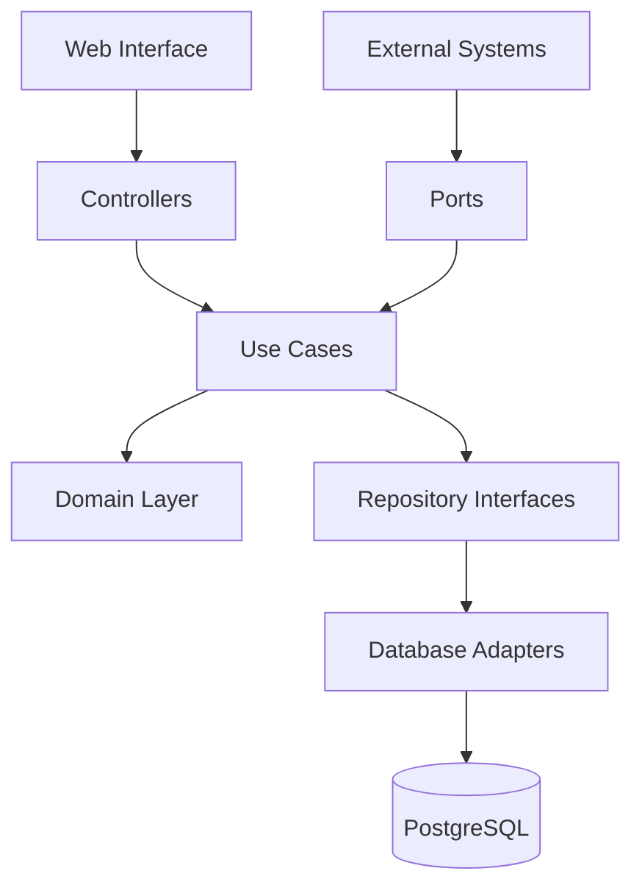
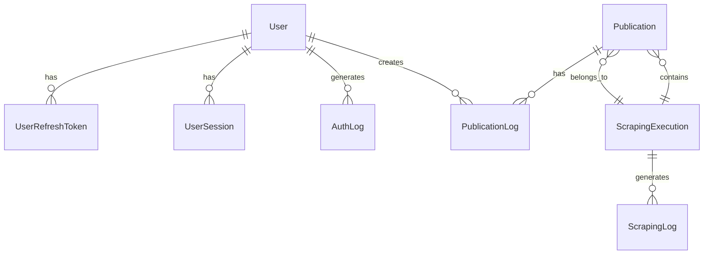
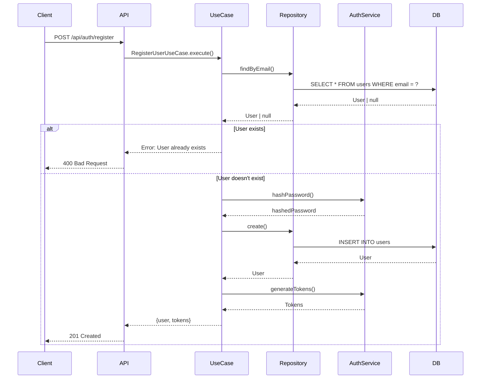
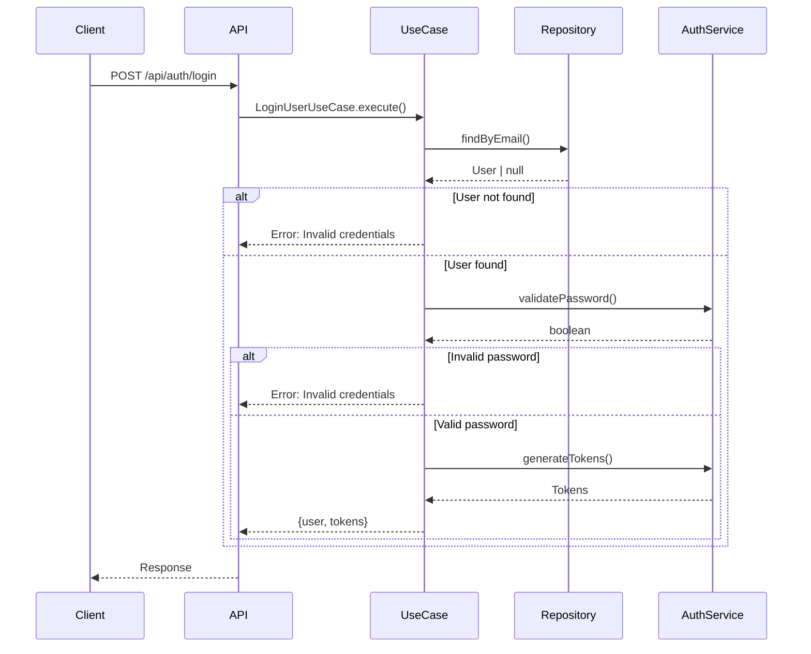
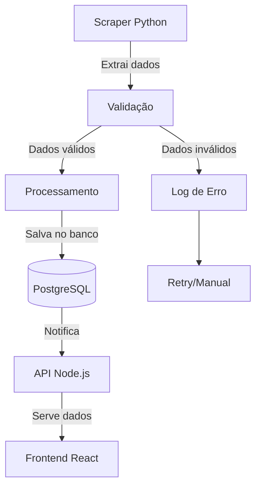

# 📚 Documentação Técnica - Sistema de Gerenciamento DJE

## 📋 Índice

1. [Visão Geral da Arquitetura](#-visão-geral-da-arquitetura)
2. [Camadas da Aplicação](#️-camadas-da-aplicação)
3. [Estrutura do Banco de Dados](#️-estrutura-do-banco-de-dados)
4. [Fluxos de Autenticação](#-fluxos-de-autenticação)
5. [Integração com Sistema de Scraping](#-integração-com-sistema-de-scraping)
6. [Validações e Regras de Negócio](#-validações-e-regras-de-negócio)
7. [Performance e Otimizações](#-performance-e-otimizações)
8. [Monitoramento e Observabilidade](#-monitoramento-e-observabilidade)
9. [Segurança](#-segurança)
10. [Deployment e DevOps](#-deployment-e-devops)

---

## 🌍 Visão Geral da Arquitetura

### Princípios Arquiteturais

O sistema segue os princípios da **Clean Architecture** (Arquitetura Hexagonal) de Robert Martin:



### Benefícios da Arquitetura Escolhida

1. **Independência de Framework**: Regras de negócio não dependem do Express.js
2. **Testabilidade**: Cada camada pode ser testada isoladamente
3. **Flexibilidade**: Fácil substituição de componentes técnicos
4. **Manutenibilidade**: Código organizado e bem estruturado
5. **Escalabilidade**: Arquitetura preparada para crescimento

---

## 🏛️ Camadas da Aplicação

### Domain Layer (Núcleo)

```typescript
// src/domain/entities/User.ts
export interface User {
  id: string;
  name: string;
  email: string;
  isActive: boolean;
  createdAt: Date;
  updatedAt: Date;
}

// src/domain/repositories/UserRepository.ts
export interface UserRepository {
  findById(id: string): Promise<User | null>;
  findByEmail(email: string): Promise<User | null>;
  create(userData: CreateUserData): Promise<User>;
  updatePassword(id: string, passwordHash: string): Promise<void>;
}
```

**Responsabilidades:**

- Definir entidades do domínio
- Estabelecer contratos (interfaces)
- Conter regras de negócio puras

### Application Layer (Casos de Uso)

```typescript
// src/application/usecases/auth/RegisterUserUseCase.ts
export class RegisterUserUseCase {
  constructor(
    private userRepository: UserRepository,
    private authService: AuthService
  ) {}

  async execute(input: RegisterUserInput): Promise<RegisterUserOutput> {
    // Validações de negócio
    // Orquestração de operações
    // Retorno de resultados
  }
}
```

**Responsabilidades:**

- Orquestrar operações de negócio
- Implementar casos de uso específicos
- Coordenar entre repositórios e serviços

### Infrastructure Layer (Implementações)

```typescript
// src/infrastructure/database/repositories/PrismaUserRepository.ts
export class PrismaUserRepository implements UserRepository {
  constructor(private prisma: PrismaClient) {}

  async findById(id: string): Promise<User | null> {
    // Implementação específica do Prisma
  }
}
```

**Responsabilidades:**

- Implementar interfaces definidas no domínio
- Lidar com detalhes técnicos (banco, web, etc.)
- Adaptar dados externos para o formato do domínio

### Web Layer (Interface)

```typescript
// src/infrastructure/web/controllers/AuthController.ts
export class AuthController {
  constructor(private registerUserUseCase: RegisterUserUseCase) {}

  register = async (req: Request, res: Response): Promise<void> => {
    // Extrair dados da requisição
    // Chamar caso de uso
    // Formatar resposta
  }
}
```

**Responsabilidades:**

- Receber requisições HTTP
- Validar entrada
- Chamar casos de uso apropriados
- Formatar respostas

---

## 🗄️ Estrutura do Banco de Dados

### Diagrama de Relacionamentos



### Tabelas Principais

#### Users

```sql
CREATE TABLE users (
    id VARCHAR PRIMARY KEY,
    name VARCHAR NOT NULL,
    email VARCHAR UNIQUE NOT NULL,
    password_hash VARCHAR NOT NULL,
    is_active BOOLEAN DEFAULT true,
    created_at TIMESTAMP DEFAULT NOW(),
    updated_at TIMESTAMP DEFAULT NOW()
);
```

#### Publications

```sql
CREATE TABLE publications (
    id VARCHAR PRIMARY KEY,
    process_number VARCHAR UNIQUE NOT NULL,
    availability_date DATE NOT NULL,
    authors TEXT[] NOT NULL,
    defendant VARCHAR DEFAULT 'Instituto Nacional do Seguro Social - INSS',
    lawyers JSONB,
    gross_value INTEGER, -- Em centavos
    net_value INTEGER,
    content TEXT NOT NULL,
    status publication_status DEFAULT 'NOVA',
    created_at TIMESTAMP DEFAULT NOW(),
    updated_at TIMESTAMP DEFAULT NOW()
);
```

### Índices para Performance

```sql
-- Índices para buscas frequentes
CREATE INDEX idx_publications_status ON publications(status);
CREATE INDEX idx_publications_availability_date ON publications(availability_date);
CREATE INDEX idx_publications_process_number ON publications(process_number);

-- Índice composto para paginação eficiente
CREATE INDEX idx_publications_status_date ON publications(status, availability_date);

-- Índice GIN para busca full-text
CREATE INDEX idx_publications_search ON publications
USING gin(to_tsvector('portuguese', content));

-- Índice para array de autores
CREATE INDEX idx_publications_authors ON publications USING gin(authors);
```

---

## 🔐 Fluxos de Autenticação

### Registro de Usuário



### Login



### Middleware de Autenticação

```typescript
export class AuthMiddleware {
  authenticate = async (req: Request, res: Response, next: NextFunction) => {
    try {
      // 1. Extrair token do header Authorization
      const token = this.extractToken(req);

      // 2. Validar token JWT
      const payload = await this.authService.validateToken(token);

      // 3. Adicionar dados do usuário à requisição
      req.user = payload;

      next();
    } catch (error) {
      res.status(401).json({ error: 'Unauthorized' });
    }
  };
}
```

---

## 🔧 Integração com Sistema de Scraping

### Fluxo de Dados do Scraper



### Estrutura de Dados Esperada

```typescript
interface ScrapedPublication {
  processNumber: string;
  availabilityDate: Date;
  authors: string[];
  content: string;
  grossValue?: number;
  netValue?: number;
  interestValue?: number;
  attorneyFees?: number;
  lawyers?: Array<{
    name: string;
    oab: string;
  }>;
}
```

### Endpoints para Integração

```typescript
// Endpoint para receber dados do scraper
POST /api/scraper/publications
Authorization: Bearer <scraper-token>

// Endpoint para monitorar execuções
GET /api/scraper/executions

// Webhook para notificações
POST /api/scraper/webhook
```

---

## ✅ Validações e Regras de Negócio

### Validação de Senhas

```typescript
const passwordSchema = z.string()
  .min(8, 'Mínimo 8 caracteres')
  .regex(/[A-Z]/, 'Deve conter maiúscula')
  .regex(/[a-z]/, 'Deve conter minúscula')
  .regex(/\d/, 'Deve conter número')
  .regex(/[!@#$%^&*(),.?":{}|<>]/, 'Deve conter caractere especial');
```

### Regras de Transição de Status

```typescript
const statusTransitions: Record<PublicationStatus, PublicationStatus[]> = {
  NOVA: ['LIDA'],
  LIDA: ['ENVIADA_PARA_ADV', 'CONCLUIDA'],
  ENVIADA_PARA_ADV: ['LIDA', 'CONCLUIDA'],
  CONCLUIDA: [], // Estado final
};

function validateStatusTransition(current: PublicationStatus, next: PublicationStatus): boolean {
  return statusTransitions[current].includes(next);
}
```

### Validação de Dados de Entrada

```typescript
export const getPublicationsSchema = z.object({
  page: z.number().min(1).optional(),
  limit: z.number().min(1).max(100).optional(),
  status: z.enum(['NOVA', 'LIDA', 'ENVIADA_PARA_ADV', 'CONCLUIDA']).optional(),
  startDate: z.date().optional(),
  endDate: z.date().optional(),
  search: z.string().min(1).optional(),
});
```

---

## ⚡ Performance e Otimizações

### Estratégias de Cache

```typescript
// Cache em memória para dados frequentes
const cache = new Map<string, { data: any; expires: number }>();

function getCached<T>(key: string): T | null {
  const item = cache.get(key);
  if (item && item.expires > Date.now()) {
    return item.data;
  }
  cache.delete(key);
  return null;
}

function setCache<T>(key: string, data: T, ttl: number = 300000): void {
  cache.set(key, {
    data,
    expires: Date.now() + ttl,
  });
}
```

### Paginação Eficiente

```typescript
// Evitar COUNT(*) custoso em grandes datasets
async function findPublications(params: FindParams): Promise<PublicationResult> {
  const limit = params.limit || 30;
  const offset = (params.page - 1) * limit;

  // Buscar um registro a mais para verificar se há próxima página
  const publications = await prisma.publication.findMany({
    where: buildWhereClause(params),
    skip: offset,
    take: limit + 1,
    orderBy: { created_at: 'desc' },
  });

  const hasNextPage = publications.length > limit;
  if (hasNextPage) publications.pop();

  return {
    publications,
    hasNextPage,
    page: params.page,
  };
}
```

### Otimizações de Queries

```sql
-- Query otimizada para busca com filtros
SELECT * FROM publications
WHERE status = $1
  AND availability_date >= $2
  AND availability_date <= $3
  AND (
    process_number ILIKE $4
    OR $4 = ANY(authors)
    OR content ILIKE $4
  )
ORDER BY created_at DESC
LIMIT $5 OFFSET $6;
```

---

## 📊 Monitoramento e Observabilidade

### Estrutura de Logs

```typescript
const logger = winston.createLogger({
  level: 'info',
  format: winston.format.combine(
    winston.format.timestamp(),
    winston.format.errors({ stack: true }),
    winston.format.json()
  ),
  defaultMeta: { service: 'dje-api' },
  transports: [
    new winston.transports.File({
      filename: 'logs/error.log',
      level: 'error'
    }),
    new winston.transports.File({
      filename: 'logs/combined.log'
    }),
  ],
});
```

### Métricas de Performance

```typescript
interface RequestMetrics {
  method: string;
  route: string;
  statusCode: number;
  responseTime: number;
  timestamp: Date;
  userId?: string;
}

class MetricsCollector {
  private metrics: RequestMetrics[] = [];

  collect(metric: RequestMetrics): void {
    this.metrics.push(metric);

    // Manter apenas últimas 1000 métricas
    if (this.metrics.length > 1000) {
      this.metrics.shift();
    }
  }

  getAverageResponseTime(): number {
    return this.metrics.reduce((sum, m) => sum + m.responseTime, 0) / this.metrics.length;
  }

  getErrorRate(): number {
    const errors = this.metrics.filter(m => m.statusCode >= 400);
    return errors.length / this.metrics.length;
  }
}
```

### Health Checks

```typescript
app.get('/health', async (req, res) => {
  const health = {
    status: 'ok',
    timestamp: new Date().toISOString(),
    uptime: process.uptime(),
    memory: process.memoryUsage(),
    database: await checkDatabaseHealth(),
    version: process.env.npm_package_version,
  };

  res.json(health);
});

async function checkDatabaseHealth(): Promise<string> {
  try {
    await prisma.$queryRaw`SELECT 1`;
    return 'connected';
  } catch (error) {
    return 'disconnected';
  }
}
```

---

## 🚔 Segurança

### Rate Limiting Inteligente

```typescript
class AdaptiveRateLimiter {
  private attempts = new Map<string, number[]>();

  isRateLimited(key: string): boolean {
    const now = Date.now();
    const windowStart = now - 15 * 60 * 1000; // 15 minutos

    // Limpar tentativas antigas
    const userAttempts = this.attempts.get(key) || [];
    const recentAttempts = userAttempts.filter(time => time > windowStart);
    this.attempts.set(key, recentAttempts);

    // Verificar limite adaptativo
    const maxAttempts = this.getMaxAttempts(recentAttempts);
    return recentAttempts.length >= maxAttempts;
  }

  private getMaxAttempts(attempts: number[]): number {
    // Mais restritivo se muitas tentativas recentes
    const recentCount = attempts.filter(time => time > Date.now() - 5 * 60 * 1000);
    return recentCount.length > 20 ? 50 : 100;
  }
}
```

### Sanitização de Inputs

```typescript
function sanitizeInput(input: string): string {
  return input
    .trim()
    .replace(/[<>]/g, '') // Remove < e >
    .substring(0, 1000);   // Limita tamanho
}

function validateUuid(id: string): boolean {
  const uuidRegex = /^[0-9a-f]{8}-[0-9a-f]{4}-[1-5][0-9a-f]{3}-[89ab][0-9a-f]{3}-[0-9a-f]{12}$/i;
  return uuidRegex.test(id);
}
```

### Headers de Segurança

```typescript
app.use(helmet({
  contentSecurityPolicy: {
    directives: {
      defaultSrc: ["'self'"],
      styleSrc: ["'self'", "'unsafe-inline'"],
      scriptSrc: ["'self'"],
      imgSrc: ["'self'", "data:", "https:"],
    },
  },
  hsts: {
    maxAge: 31536000,
    includeSubDomains: true,
    preload: true
  }
}));
```

---

## 🚀 Deployment e DevOps

### Dockerfile Multi-stage

```dockerfile
# Estágio de construção
FROM node:20-alpine AS builder
WORKDIR /app
COPY package*.json ./
RUN npm ci --only=production && npm cache clean --force
COPY . .
RUN npm run build

# Estágio de produção
FROM node:20-alpine AS production
RUN apk add --no-cache dumb-init
RUN addgroup -g 1001 -S nodejs
RUN adduser -S nodejs -u 1001
WORKDIR /app
COPY --from=builder --chown=nodejs:nodejs /app .
USER nodejs
EXPOSE 3001
CMD ["dumb-init", "node", "dist/app.js"]
```

### Docker Compose para Produção

```yaml
version: '3.8'
services:
  api:
    build: .
    environment:
      NODE_ENV: production
      DATABASE_URL: ${DATABASE_URL}
    ports:
      - "3001:3001"
    restart: unless-stopped
    healthcheck:
      test: ["CMD", "curl", "-f", "http://localhost:3001/health"]
      interval: 30s
      timeout: 10s
      retries: 3
    deploy:
      resources:
        limits:
          memory: 512M
          cpus: '0.5'
        reservations:
          memory: 256M
          cpus: '0.25'
```

### Configuração de Produção

```typescript
export const productionConfig = {
  // Logs estruturados
  logging: {
    level: 'warn',
    format: 'json',
    transports: ['file', 'console']
  },

  // Limites de segurança
  security: {
    rateLimitStrict: true,
    maxRequestSize: '1mb',
    sessionTimeout: 15 * 60 * 1000 // 15 minutos
  },

  // Performance
  performance: {
    compression: true,
    keepAliveTimeout: 65000,
    headersTimeout: 66000
  }
};
```

---

## 🔍 Troubleshooting

### Problemas Comuns e Soluções

#### 1. Erro de Conexão com Banco

**Sintomas:**

```txt
Error: connect ECONNREFUSED 127.0.0.1:5432
```

**Soluções:**

1. Verificar se PostgreSQL está rodando
2. Confirmar string de conexão
3. Verificar configurações de firewall

#### 2. JWT Token Inválido

**Sintomas:**

```json
{
  "success": false,
  "error": "Invalid or expired token"
}
```

**Soluções:**

1. Verificar se token está sendo enviado no header
2. Confirmar formato: `Authorization: Bearer <token>`
3. Verificar se JWT_SECRET está definido corretamente

#### 3. Performance Lenta

**Sintomas:**

- Respostas demoradas
- Timeouts frequentes

**Soluções:**

1. Verificar índices do banco de dados
2. Implementar cache para queries frequentes
3. Otimizar queries N+1
4. Aumentar connection pool do Prisma

### Scripts de Diagnóstico

```bash
#!/bin/bash
# scripts/health-check.sh

echo "🔍 Verificando saúde do sistema..."

# Verificar API
curl -f http://localhost:3001/health || echo "❌ API não está respondendo"

# Verificar banco
docker exec dje-postgres pg_isready -U dje_user || echo "❌ Banco não está disponível"

# Verificar logs de erro
if [ -f "logs/error.log" ]; then
    echo "📋 Últimos erros:"
    tail -10 logs/error.log
fi

echo "✅ Verificação concluída"
```

---

## 📈 Roadmap Técnico

### Próximas Implementações

1. **Cache Distribuído com Redis**
   - Cache de sessões
   - Cache de queries frequentes
   - Rate limiting distribuído

2. **Testes Automatizados**
   - Testes unitários (Jest)
   - Testes de integração
   - Testes E2E (Cypress)

3. **Observabilidade Avançada**
   - Métricas com Prometheus
   - Tracing distribuído
   - Alertas automatizados

4. **CI/CD Pipeline**
   - GitHub Actions
   - Deploy automatizado
   - Rollback automático

5. **Otimizações de Performance**
   - Query optimization
   - Database sharding
   - CDN para assets estáticos

---

**Documentação mantida por:** Junior Martins
**Última atualização:** Dezembro 2024
**Versão da API:** 1.0.0
