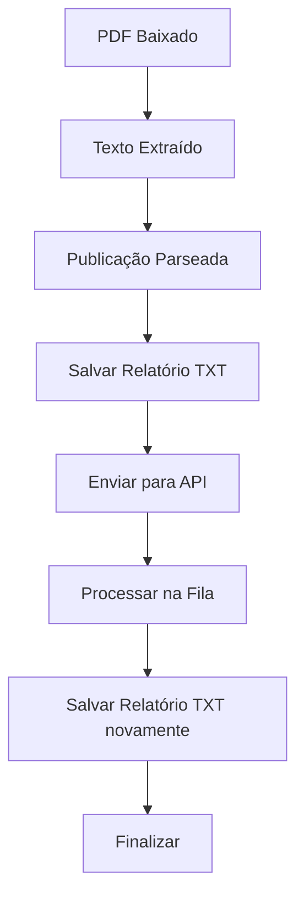

# Salvamento Automático de Relatórios TXT

## Visão Geral

Esta funcionalidade permite que o JusCash Scraper salve automaticamente cada relatório extraído dos PDFs como um arquivo TXT detalhado. Cada publicação processada gera um arquivo individual contendo todas as informações extraídas em formato legível.

## Características

### ✅ Funcionalidades Implementadas

- **Salvamento Automático**: Cada publicação extraída é automaticamente salva como arquivo TXT
- **Organização por Data**: Relatórios são organizados em subdiretórios por data (YYYY-MM-DD)
- **Conteúdo Completo**: Inclui todas as informações da publicação (processo, autores, advogados, valores, conteúdo completo)
- **Metadados de Extração**: Informações sobre como e quando o relatório foi extraído
- **Configuração Flexível**: Permite personalizar comportamento via variáveis de ambiente
- **Tratamento de Erros**: Funciona mesmo com dados incompletos
- **Limpeza Automática**: Remove relatórios antigos automaticamente

### 📄 Formato dos Relatórios

Cada arquivo TXT contém:

```
RELATÓRIO DE PUBLICAÇÃO EXTRAÍDA - DJE-SP
================================================================================
Data de Extração: 15/06/2025 19:30:45
Sistema: JusCash Scraper
================================================================================

INFORMAÇÕES DO PROCESSO
----------------------------------------
Número do Processo: 0013168-70.2024.8.26.0053
Data de Publicação: 13/11/2024
Data de Disponibilização: 15/06/2025 19:30:01

PARTES DO PROCESSO
----------------------------------------
Réu: Instituto Nacional do Seguro Social - INSS

AUTORES:
  - Sheila de Oliveira

ADVOGADOS:
  - Eunice Mendonca da Silva Carvalho (OAB: 138649)
  - Patricia Mendonça de Carvalho Araújo (OAB: 332295)

VALORES MONETÁRIOS
----------------------------------------
Valor Bruto: R$ 129.144,23
Valor Líquido: R$ 113.611,90
Juros: R$ 0,00
Honorários Advocatícios: R$ 15.532,33

CONTEÚDO COMPLETO DA PUBLICAÇÃO
--------------------------------------------------------------------------------
[Conteúdo completo da decisão judicial...]
--------------------------------------------------------------------------------

METADADOS DE EXTRAÇÃO
----------------------------------------
Extraction Date: 15/06/2025 19:30:01
Source Url: /tmp/dje_scraper_pdfs/dje_20250615_193001_091766.pdf
Extraction Method: enhanced_rpv_inss_pattern
Match Type: pagamento pelo INSS
Match Position: 2038
Process Spans Pages: False
Text Length: 5117

INFORMAÇÕES DO SISTEMA
----------------------------------------
Status: NOVA
Fonte de Scraping: DJE-SP
Caderno: 3
Instância: 1
Local: Capital
Parte: 1

================================================================================
Relatório gerado automaticamente pelo JusCash Scraper
Arquivo: 20250615_193045.txt
================================================================================
```

## Configuração

### Variáveis de Ambiente

Você pode personalizar o comportamento através das seguintes variáveis de ambiente:

```bash
# Diretório onde salvar os relatórios
REPORT_OUTPUT_DIR=./relatorios_extraidos

# Habilitar/desabilitar salvamento (true/false)
REPORT_ENABLED=true

# Incluir metadados no relatório (true/false)
REPORT_INCLUDE_METADATA=true

# Incluir valores monetários (true/false)
REPORT_INCLUDE_VALUES=true

# Incluir conteúdo completo (true/false)
REPORT_INCLUDE_CONTENT=true

# Dias para manter relatórios (limpeza automática)
REPORT_CLEANUP_DAYS=30

# Habilitar limpeza automática (true/false)
REPORT_AUTO_CLEANUP=true

# Encoding dos arquivos
REPORT_ENCODING=utf-8

# Organizar por data (true/false)
REPORT_ORGANIZE_BY_DATE=true

# Formato de data para subdiretórios
REPORT_DATE_FORMAT=%Y-%m-%d
```

### Exemplo de Configuração no Docker

```yaml
# docker-compose.yml
services:
  scraper:
    environment:
      - REPORT_OUTPUT_DIR=/app/reports
      - REPORT_ENABLED=true
      - REPORT_CLEANUP_DAYS=60
    volumes:
      - ./reports:/app/reports
```

## Estrutura de Diretórios

```
relatorios_extraidos/
├── 2025-06-15/
│   ├── relatorio_0013168-70_2024_8_26_0053_193045_123.txt
│   ├── relatorio_0029544-34_2024_8_26_0053_193046_456.txt
│   └── ...
├── 2025-06-16/
│   ├── relatorio_0012345-67_2024_8_26_0053_094521_789.txt
│   └── ...
└── ...
```

## Integração no Fluxo do Scraper

### Pontos de Integração

A funcionalidade está integrada em **todos os pontos** onde publicações são processadas:

1. **DJE Scraper Adapter** (`dje_scraper_adapter.py`)
   - Salvamento imediato após extração do PDF
   - Funciona com parser aprimorado e tradicional
   - Inclui fallback para conteúdo HTML

2. **Publication Worker** (`publication_worker.py`)
   - Salvamento antes de enviar para API
   - Garante que todas as publicações sejam salvas
   - Funciona com processamento em fila

### Fluxo de Execução



## Monitoramento e Logs

### Logs de Salvamento

```
📄 Relatório TXT salvo: ./relatorios_extraidos/2025-06-15/relatorio_0013168-70_2024_8_26_0053_193045_123.txt
📄 Relatório TXT salvo (worker): ./relatorios_extraidos/2025-06-15/relatorio_0029544-34_2024_8_26_0053_193046_456.txt
⚠️ Falha ao salvar relatório TXT para 0012345-67.2024.8.26.0053
❌ Erro ao salvar relatório TXT: [detalhes do erro]
```

### Estatísticas

```python
from infrastructure.files.report_txt_saver import ReportTxtSaver

report_saver = ReportTxtSaver()
stats = report_saver.get_daily_stats()

print(f"Total de relatórios hoje: {stats['total_reports']}")
print(f"Diretório: {stats['directory']}")
print(f"Arquivos recentes: {stats['files']}")
```

## Testes

### Executar Teste Manual

```bash
cd backend/scraper/src
python local/test_report_saver.py
```

### Teste de Integração

```bash
cd backend/scraper/src
python local/test_integration.py
```

## Resolução de Problemas

### Problemas Comuns

**1. Relatórios não sendo salvos**
- Verificar se `REPORT_ENABLED=true`
- Verificar permissões do diretório
- Verificar logs para erros específicos

**2. Diretório não criado**
- Verificar permissões de escrita
- Verificar se o path está correto
- Verificar variável `REPORT_OUTPUT_DIR`

**3. Arquivos vazios ou com erro**
- Verificar encoding (`REPORT_ENCODING`)
- Verificar se os dados da publicação estão válidos
- Verificar logs de erro

### Debug

Para debug mais detalhado, ative os logs de debug:

```python
import logging
logging.getLogger('infrastructure.files.report_txt_saver').setLevel(logging.DEBUG)
```

## Benefícios

### ✅ Vantagens

1. **Backup Completo**: Todos os relatórios extraídos ficam salvos em formato legível
2. **Auditoria**: Histórico completo de extrações para análise posterior
3. **Recuperação**: Dados disponíveis mesmo se API falhar
4. **Análise**: Fácil análise manual dos relatórios extraídos
5. **Conformidade**: Mantém registro detalhado das operações

### 📊 Impacto na Performance

- **Mínimo**: Operação assíncrona, não bloqueia o fluxo principal
- **Armazenamento**: ~2-5KB por relatório (dependendo do conteúdo)
- **Limpeza**: Automática, remove arquivos antigos

## Roadmap Futuro

### 🚀 Melhorias Planejadas

- [ ] Compressão automática de relatórios antigos
- [ ] Exportação para outros formatos (JSON, CSV)
- [ ] Dashboard web para visualizar relatórios salvos
- [ ] API para consultar relatórios salvos
- [ ] Notificações por email de relatórios importantes

---

**Desenvolvido para JusCash Scraper v1.0**  
**Data: Junho 2025** 