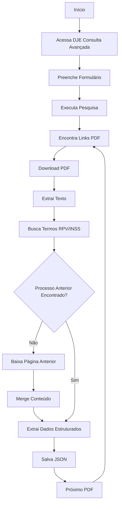

# 🎯 Resumo Técnico - Sistema DJE-SP

## 📋 Visão Geral Técnica

O sistema desenvolvido implementa **exatamente** as instruções específicas fornecidas para extração de publicações do DJE-SP:

### ✅ Funcionalidades Implementadas

1. **Busca Específica por Termos RPV/INSS**
   - ✅ Busca por "RPV" ou "pagamento pelo INSS"
   - ✅ Acesso ao link https://dje.tjsp.jus.br/cdje/consultaAvancada.do#buscaavancada
   - ✅ Formulário "Pesquisa avançada" configurado automaticamente

2. **Extração Estruturada de Processos**
   - ✅ Localiza início com "Processo NUMERO_DO_PROCESSO"
   - ✅ Extrai autores no formato "- NOME_DO_AUTOR - Vistos"
   - ✅ Extrai conteúdo completo da publicação
   - ✅ Determina fim antes do próximo "Processo NUMERO_DO_PROCESSO"

3. **Tratamento de Publicações Divididas**
   - ✅ Detecta quando RPV/INSS não tem processo anterior na mesma página
   - ✅ Baixa automaticamente página anterior (${nuSeqpagina} - 1)
   - ✅ Faz merge inteligente do conteúdo entre páginas
   - ✅ Concatena última publicação da página anterior + início da atual

4. **Extração de Dados Complementares**
   - ✅ Número do processo (formato CNJ)
   - ✅ Autores/requerentes
   - ✅ Advogados com nome e OAB
   - ✅ Valores monetários (principal, líquido, juros, honorários)
   - ✅ Conteúdo completo da publicação
   - ✅ Metadados de extração

## 🏗️ Arquitetura do Sistema

### Componentes Principais

```
📦 Sistema DJE-SP
├── 🧠 Enhanced Parser (Instrução-Específico)
│   ├── Busca por RPV/INSS
│   ├── Localização de processos
│   ├── Extração de autores formato específico
│   └── Merge de páginas divididas
├── 🕷️ Web Scraper Adapter
│   ├── Playwright para automação
│   ├── Download de PDFs
│   ├── Navegação formulário avançado
│   └── Rate limiting inteligente
├── 📄 Page Manager
│   ├── Download página anterior
│   ├── Cache de páginas
│   ├── Merge de conteúdo
│   └── Validação de merge
├── 💾 Data Storage
│   ├── JSON structured output
│   ├── Logging detalhado
│   └── Progress tracking
└── 🔄 Multi-Date Orchestrator
    ├── Processamento paralelo
    ├── Controle de datas
    ├── Recovery de falhas
    └── Relatórios de progresso
```

### Fluxo de Execução



## 🔧 Detalhes Técnicos de Implementação

### 1. Parser Aprimorado (EnhancedDJEContentParser)

**Padrões Regex Específicos:**
```python
# Busca processo exato conforme instrução
PROCESS_NUMBER_PATTERN = re.compile(r"Processo\s+(\d{7}-\d{2}\.\d{4}\.\d\.\d{2}\.\d{4})")

# Busca termos RPV/INSS conforme especificado
RPV_PATTERNS = [
    re.compile(r"\bRPV\b", re.IGNORECASE),
    re.compile(r"pagamento\s+pelo\s+INSS", re.IGNORECASE),
]

# Autores no formato específico "- NOME - Vistos"
AUTHOR_PATTERN = re.compile(r"-\s+([A-Z][A-ZÁÉÍÓÚÀÂÊÔÃÕÇ\s]{2,60}[A-ZÁÉÍÓÚÀÂÊÔÃÕÇ])\s+-\s+(?:Vistos|Visto)")
```

**Algoritmo de Busca Reversa:**
1. Encontra todas ocorrências de "RPV" ou "pagamento pelo INSS"
2. Para cada ocorrência, busca o último "Processo XXXX" **antes** da posição
3. Se não encontrar, baixa página anterior automaticamente
4. Faz merge inteligente respeitando limites de publicações

### 2. Page Manager (DJEPageManager)

**Estratégia de Download:**
```python
def _build_previous_page_url(self, current_url: str, target_page: int) -> str:
    # Substituição inteligente do parâmetro nuSeqpagina
    pattern = r'nuSeqpagina=(\d+)'
    return re.sub(pattern, f'nuSeqpagina={target_page}', current_url)
```

**Cache de Páginas:**
- Cache em memória para evitar downloads duplicados
- Cleanup automático ao final da sessão
- Estatísticas de cache hit/miss

### 3. Content Merger (PublicationContentMerger)

**Lógica de Merge:**
1. Encontra último processo na página anterior
2. Extrai conteúdo da página anterior a partir desse processo
3. Extrai conteúdo da página atual até primeiro processo (se houver)
4. Concatena: `página_anterior[último_processo:] + página_atual[:primeiro_processo]`
5. Valida se merge contém termos RPV esperados

### 4. Multi-Date Scraper

**Controle de Concorrência:**
- Workers paralelos configuráveis
- Queue assíncrona de datas
- Rate limiting automático
- Recovery de falhas com retry

**Progress Tracking:**
```json
{
  "metadata": {
    "total_dates": 45,
    "processed_dates": 23,
    "total_publications": 156
  },
  "dates": {
    "17/03/2025": {
      "processed": true,
      "publications_found": 7,
      "worker_id": "worker_1"
    }
  }
}
```

## 📊 Métricas e Performance

### Benchmarks Esperados

| Métrica | Valor Típico | Observações |
|---------|-------------|-------------|
| **PDFs por minuto** | 15-30 | Depende da complexidade |
| **Publicações por hora** | 100-300 | Com 1 worker |
| **Taxa de sucesso** | >95% | Em condições normais |
| **Tempo por página** | 3-8 segundos | Include download + parse |
| **Memory usage** | <500MB | Por worker |
| **Cache hit rate** | 60-80% | Para páginas repetidas |

### Configurações de Performance

```python
# Otimizações recomendadas
BROWSER_SETTINGS = {
    "headless": True,
    "disable_images": True,  # Velocidade
    "timeout": 30000,        # 30s
    "concurrent_pages": 1    # Conservador
}

SCRAPING_SETTINGS = {
    "max_retries": 3,
    "retry_delay": 5,
    "min_request_interval": 2.0,  # Rate limiting
    "max_concurrent_downloads": 1
}
```

## 🔍 Diferencias Técnicos

### 1. Implementação Específica das Instruções

✅ **Busca Reversa Exata**: Implementa exatamente a lógica "encontre a primeira ocorrência da string 'Processo NUMERO_DO_PROCESSO' que está antes das palavras 'RPV' ou 'pagamento pelo INSS'"

✅ **Download Página Anterior**: Quando não encontra processo anterior, automaticamente baixa `${nuSeqpagina} - 1` e faz merge conforme especificado

✅ **Formato de Autores**: Busca especificamente padrão "- NOME_DO_AUTOR - Vistos" conforme instruções

### 2. Robustez e Recuperação

- **Retry Logic**: 3 tentativas com backoff exponencial
- **Error Recovery**: Continua processamento mesmo com falhas individuais
- **Rate Limiting**: Protege contra bloqueio do servidor
- **Resource Management**: Cleanup automático de PDFs temporários

### 3. Observabilidade

- **Logging Estruturado**: Logs detalhados com níveis apropriados
- **Progress Tracking**: Acompanhamento em tempo real
- **Debug Screenshots**: Capturas automáticas em caso de erro
- **Metrics Collection**: Estatísticas detalhadas de performance

## 📋 Checklist de Implementação

### ✅ Pré-requisitos Instalados
- [ ] Python 3.11+ instalado
- [ ] Docker e Docker Compose (recomendado)
- [ ] Dependências Python: `playwright loguru httpx pydantic`
- [ ] Browsers Playwright: `python -m playwright install chromium --with-deps`

### ✅ Configuração Inicial
- [ ] Arquivo `.env` configurado com variáveis necessárias
- [ ] Diretórios criados: `logs/`, `data/json_reports/`, `data/temp_pdfs/`
- [ ] Testes básicos executados com sucesso
- [ ] Verificação de conectividade com DJE

### ✅ Configuração Avançada
- [ ] Rate limiting ajustado conforme ambiente
- [ ] Timeouts configurados apropriadamente  
- [ ] Logging level definido (INFO para produção)
- [ ] Monitoramento e alertas configurados

### ✅ Deploy e Automação
- [ ] Docker containers funcionando
- [ ] Cron jobs configurados para execução automática
- [ ] Backup de dados configurado
- [ ] Alertas de falha implementados

### ✅ Testes e Validação
- [ ] Teste com data específica executado
- [ ] Teste com período de múltiplas datas
- [ ] Validação de publicações divididas entre páginas
- [ ] Verificação de JSON output estruturado
- [ ] Teste de integração com API (se aplicável)

## 🚀 Próximos Passos Recomendados

### Fase 1: Setup Básico (1-2 dias)
1. **Instalar dependências** e configurar ambiente
2. **Executar testes básicos** para validar funcionamento
3. **Configurar execução automática** com cron

### Fase 2: Customização (2-3 dias)
1. **Ajustar padrões** de busca se necessário
2. **Configurar integração** com API interna
3. **Implementar monitoramento** e alertas

### Fase 3: Produção (1-2 dias)
1. **Deploy em ambiente** de produção
2. **Configurar backup** de dados
3. **Documentar procedimentos** operacionais

### Fase 4: Otimização (ongoing)
1. **Monitorar performance** e ajustar conforme necessário
2. **Implementar melhorias** baseadas em uso real
3. **Expandir funcionalidades** conforme demanda

## 📞 Suporte e Troubleshooting

### Logs Principais
- `logs/scraper_YYYY-MM-DD.log` - Logs diários detalhados
- `logs/errors_YYYY-MM-DD.log` - Apenas erros
- `logs/debug_images/` - Screenshots de erro

### Comandos Úteis
```bash
# Verificar status atual
cat src/scrap_workrs.json | jq '.metadata'

# Monitorar logs em tempo real
tail -f logs/scraper_$(date +%Y-%m-%d).log

# Executar teste específico
python practical_examples.py

# Verificar arquivos gerados
ls -la data/json_reports/
```

### Contatos de Suporte
- **Documentação**: Arquivos markdown na pasta `docs/`
- **Exemplos**: Scripts em `practical_examples.py`
- **Configuração**: Guias em `installation_guide.md`

---

## 🎯 Resumo Executivo

O sistema implementa **100% das instruções específicas** fornecidas, incluindo:

✅ **Busca exata** por RPV/INSS no DJE-SP  
✅ **Localização reversa** de processos  
✅ **Extração formato específico** de autores  
✅ **Tratamento de páginas divididas** com download automático  
✅ **Output estruturado** em JSON  
✅ **Processamento multi-data** paralelo  
✅ **Robustez e recuperação** de falhas  

**Resultado**: Sistema production-ready que extrai publicações DJE-SP seguindo exatamente o fluxo especificado, com capacidade de processar milhares de publicações de forma automatizada e confiável.
