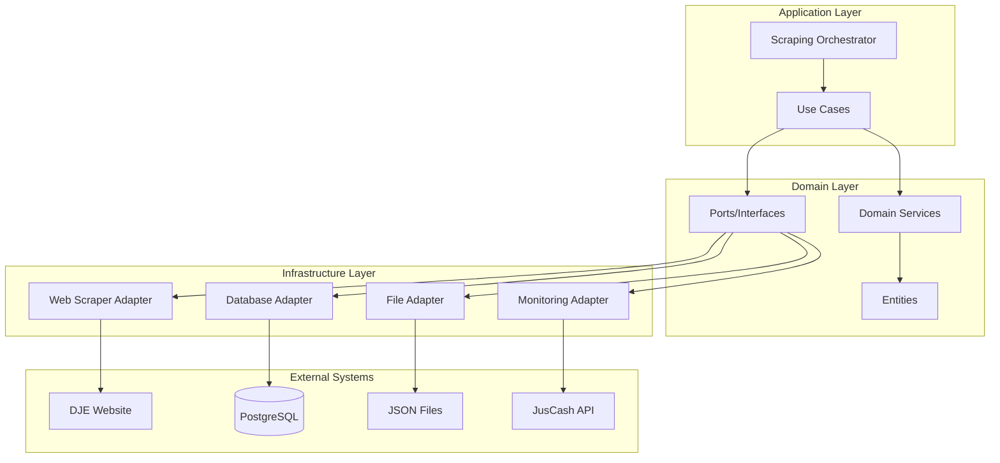
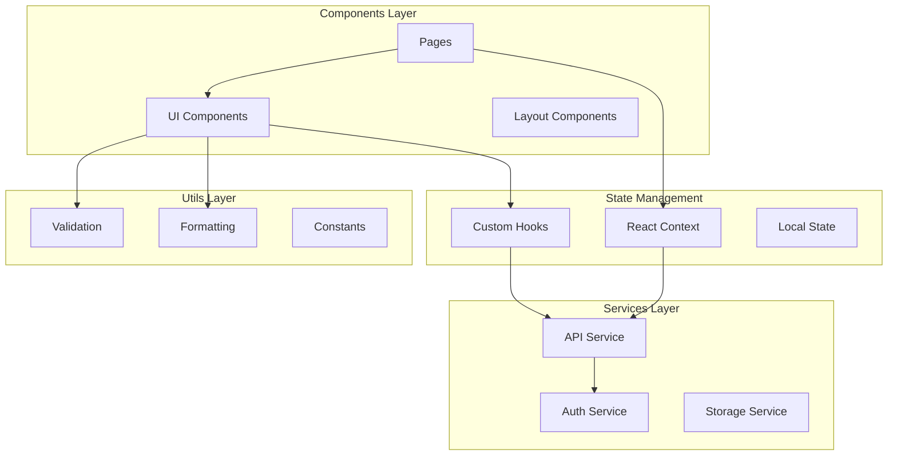

# 🔧 Documentação Técnica - JusCash (Parte 2)

## 🕷️ Sistema de Scraping

### Arquitetura do Scraper

O sistema de scraping é desenvolvido em Python seguindo os princípios de **Arquitetura Hexagonal**, garantindo separação clara entre lógica de negócio e implementações técnicas.



### Componentes Principais

#### 1. Scraping Orchestrator
**Localização**: `backend/scraper/src/application/services/scraping_orchestrator.py`

Responsável por orquestrar todo o processo de scraping:

```python
class ScrapingOrchestrator:
    def __init__(self, web_scraper, data_validator, file_saver, db_repository):
        self.web_scraper = web_scraper
        self.data_validator = data_validator
        self.file_saver = file_saver
        self.db_repository = db_repository
    
    async def execute_scraping(self, criteria: ScrapingCriteria) -> ScrapingResult:
        """
        Executa o processo completo de scraping
        """
        execution = await self.start_execution(criteria)
        
        try:
            # 1. Extrair publicações do DJE
            raw_publications = await self.web_scraper.extract_publications(criteria)
            
            # 2. Validar e processar dados
            validated_publications = []
            for raw_pub in raw_publications:
                if self.data_validator.is_valid(raw_pub):
                    publication = self.data_validator.process(raw_pub)
                    validated_publications.append(publication)
            
            # 3. Salvar em arquivos de backup
            await self.file_saver.save_publications(validated_publications)
            
            # 4. Persistir no banco de dados
            saved_count = await self.db_repository.save_publications(validated_publications)
            
            # 5. Finalizar execução
            await self.complete_execution(execution, saved_count)
            
            return ScrapingResult(
                success=True,
                publications_found=len(raw_publications),
                publications_saved=saved_count
            )
            
        except Exception as e:
            await self.fail_execution(execution, str(e))
            raise
```

#### 2. Web Scraper Adapter
**Localização**: `backend/scraper/src/infrastructure/web/dje_scraper_adapter.py`

Implementa a extração de dados do DJE usando Playwright:

```python
class DJEScraperAdapter:
    def __init__(self):
        self.browser = None
        self.page = None
        
    async def extract_publications(self, criteria: ScrapingCriteria) -> List[RawPublication]:
        """
        Extrai publicações do DJE baseado nos critérios
        """
        await self.initialize_browser()
        
        try:
            # 1. Navegar para o DJE
            await self.navigate_to_dje()
            
            # 2. Preencher formulário de busca
            await self.fill_search_form(criteria)
            
            # 3. Submeter busca
            await self.submit_search()
            
            # 4. Extrair resultados
            publications = await self.extract_results()
            
            return publications
            
        finally:
            await self.cleanup_browser()
    
    async def navigate_to_dje(self):
        """Navega para a página do DJE"""
        url = "https://dje.tjsp.jus.br/cdje/consultaSimples.do"
        await self.page.goto(url, wait_until="networkidle")
        
    async def fill_search_form(self, criteria: ScrapingCriteria):
        """Preenche o formulário de busca"""
        # Selecionar caderno
        await self.page.select_option("#caderno", criteria.caderno)
        
        # Selecionar instância
        await self.page.select_option("#instancia", criteria.instancia)
        
        # Data de publicação
        await self.page.fill("#dtPublicacao", criteria.publication_date.strftime("%d/%m/%Y"))
        
        # Termos de busca (se especificados)
        if criteria.search_terms:
            await self.page.fill("#palavrasChave", " ".join(criteria.search_terms))
    
    async def extract_results(self) -> List[RawPublication]:
        """Extrai as publicações dos resultados"""
        publications = []
        
        # Aguardar carregamento dos resultados
        await self.page.wait_for_selector(".resultadoLista")
        
        # Extrair cada publicação
        publication_elements = await self.page.query_selector_all(".publicacao")
        
        for element in publication_elements:
            try:
                publication_data = await self.extract_publication_data(element)
                publications.append(RawPublication(**publication_data))
            except Exception as e:
                logger.warning(f"Erro ao extrair publicação: {e}")
                continue
        
        return publications
```

#### 3. Content Parser
**Localização**: `backend/scraper/src/infrastructure/web/enhanced_content_parser.py`

Processa o conteúdo das publicações extraindo informações estruturadas:

```python
class EnhancedContentParser:
    def __init__(self):
        self.value_patterns = {
            'gross_value': r'valor\s+bruto[:\s]+r\$\s*([\d.,]+)',
            'net_value': r'valor\s+líquido[:\s]+r\$\s*([\d.,]+)',
            'attorney_fees': r'honorários[:\s]+r\$\s*([\d.,]+)',
            'interest_value': r'juros[:\s]+r\$\s*([\d.,]+)'
        }
        
    def parse_publication(self, raw_content: str) -> ParsedPublication:
        """
        Processa o conteúdo bruto da publicação
        """
        return ParsedPublication(
            process_number=self.extract_process_number(raw_content),
            authors=self.extract_authors(raw_content),
            defendant=self.extract_defendant(raw_content),
            lawyers=self.extract_lawyers(raw_content),
            values=self.extract_values(raw_content),
            content=self.clean_content(raw_content)
        )
    
    def extract_process_number(self, content: str) -> Optional[str]:
        """Extrai o número do processo"""
        pattern = r'(\d{7}-\d{2}\.\d{4}\.\d{1}\.\d{2}\.\d{4})'
        match = re.search(pattern, content)
        return match.group(1) if match else None
    
    def extract_values(self, content: str) -> Dict[str, int]:
        """Extrai valores monetários convertendo para centavos"""
        values = {}
        
        for value_type, pattern in self.value_patterns.items():
            match = re.search(pattern, content, re.IGNORECASE)
            if match:
                value_str = match.group(1).replace('.', '').replace(',', '.')
                try:
                    # Converter para centavos
                    value_cents = int(float(value_str) * 100)
                    values[value_type] = value_cents
                except ValueError:
                    continue
        
        return values
```

### Configuração e Agendamento

#### 1. Configurações Dinâmicas
**Localização**: `backend/scraper/src/infrastructure/config/settings.py`

```python
class ScrapingSettings:
    # Configurações do DJE
    DJE_BASE_URL = "https://dje.tjsp.jus.br"
    DJE_TIMEOUT = 30000  # 30 segundos
    
    # Configurações do navegador
    BROWSER_HEADLESS = True
    BROWSER_USER_AGENT = "Mozilla/5.0 (compatible; JusCashBot/1.0)"
    
    # Configurações de retry
    MAX_RETRIES = 3
    RETRY_DELAY = 5  # segundos
    
    # Filtros automáticos
    REQUIRED_TERMS = ["Instituto Nacional", "INSS", "Seguro Social"]
    EXCLUDED_TERMS = ["arquivado", "extinto"]
    
    # Limites de segurança
    MAX_PUBLICATIONS_PER_RUN = 1000
    MAX_EXECUTION_TIME = 3600  # 1 hora
    
    @classmethod
    def load_from_env(cls):
        """Carrega configurações das variáveis de ambiente"""
        return cls(
            dje_caderno=os.getenv('DJE_CADERNO', '3'),
            dje_instancia=os.getenv('DJE_INSTANCIA', '1'),
            browser_headless=os.getenv('SCRAPING_HEADLESS', 'true').lower() == 'true',
            required_terms=os.getenv('SCRAPING_REQUIRED_TERMS', '').split(',')
        )
```

#### 2. Agendamento Automático
**Localização**: `backend/scraper/src/infrastructure/scheduler/scheduler_adapter.py`

```python
class SchedulerAdapter:
    def __init__(self):
        self.scheduler = AsyncIOScheduler()
        
    def start_daily_scraping(self):
        """Inicia agendamento diário de scraping"""
        self.scheduler.add_job(
            func=self.execute_daily_scraping,
            trigger="cron",
            hour=8,  # 8h da manhã
            minute=0,
            timezone="America/Sao_Paulo",
            id="daily_scraping",
            replace_existing=True
        )
        
        self.scheduler.start()
        logger.info("Agendamento diário de scraping iniciado")
    
    async def execute_daily_scraping(self):
        """Executa scraping diário automaticamente"""
        try:
            criteria = ScrapingCriteria(
                publication_date=datetime.now().date() - timedelta(days=1),  # Dia anterior
                caderno="3",
                instancia="1",
                search_terms=settings.REQUIRED_TERMS
            )
            
            orchestrator = get_scraping_orchestrator()
            result = await orchestrator.execute_scraping(criteria)
            
            logger.info(f"Scraping diário concluído: {result.publications_saved} publicações salvas")
            
        except Exception as e:
            logger.error(f"Erro no scraping diário: {e}")
            await self.send_error_alert(e)
```

### Monitoramento e Alertas

#### 1. Sistema de Monitoramento
**Localização**: `backend/scraper/src/infrastructure/monitoring/monitoring_service.py`

```python
class MonitoringService:
    def __init__(self, api_client):
        self.api_client = api_client
        
    async def track_execution(self, execution_id: str, metrics: Dict):
        """Registra métricas de execução"""
        await self.api_client.post("/api/scraping/executions/{execution_id}/metrics", metrics)
        
    async def send_health_check(self):
        """Envia status de saúde do scraper"""
        health_data = {
            "status": "healthy",
            "last_execution": self.get_last_execution_time(),
            "system_metrics": self.get_system_metrics(),
            "pending_tasks": self.get_pending_tasks_count()
        }
        
        await self.api_client.post("/api/scraping/health", health_data)
    
    def get_system_metrics(self) -> Dict:
        """Coleta métricas do sistema"""
        import psutil
        
        return {
            "cpu_percent": psutil.cpu_percent(),
            "memory_percent": psutil.virtual_memory().percent,
            "disk_usage": psutil.disk_usage('/').percent,
            "uptime": time.time() - psutil.boot_time()
        }
```

---

## ⚛️ Frontend React

### Arquitetura do Frontend

O frontend é desenvolvido em React com TypeScript, seguindo padrões modernos de desenvolvimento:



### Componentes Principais

#### 1. KanbanBoard Component
**Localização**: `frontend/src/components/KanbanBoard.tsx`

Componente central da aplicação que implementa o board Kanban:

```typescript
interface KanbanBoardProps {
  filters: SearchFilters
}

export function KanbanBoard({ filters }: KanbanBoardProps) {
  const [columns, setColumns] = useState<Map<PublicationStatus, KanbanColumn>>(new Map())
  const [selectedPublication, setSelectedPublication] = useState<Publication | null>(null)
  const [loading, setLoading] = useState(true)
  const [loadingMore, setLoadingMore] = useState<Set<PublicationStatus>>(new Set())
  
  // Configuração das colunas
  const COLUMN_CONFIG: Record<PublicationStatus, { title: React.ReactNode; color: string }> = {
    NOVA: { title: 'Nova Publicação', color: 'bg-blue-50 border-blue-200' },
    LIDA: { title: 'Publicação Lida', color: 'bg-yellow-50 border-yellow-200' },
    ENVIADA_PARA_ADV: { title: 'Enviar para Advogado', color: 'bg-orange-50 border-orange-200' },
    CONCLUIDA: { title: 'Concluído', color: 'bg-green-50 border-green-200' }
  }
  
  // Carregamento de dados com paginação
  const loadPublications = useCallback(async (
    status: PublicationStatus,
    page: number = 1,
    reset: boolean = false
  ) => {
    try {
      const response = await apiService.getPublications(page, 30, {
        ...filters,
        status
      })
      
      setColumns(prev => {
        const newColumns = new Map(prev)
        const existingColumn = newColumns.get(status)
        const existingPublications = reset ? [] : existingColumn?.publications || []
        
        newColumns.set(status, {
          id: status,
          title: COLUMN_CONFIG[status].title,
          publications: [...existingPublications, ...response.data],
          count: response.total || 0
        })
        
        return newColumns
      })
      
    } catch (error) {
      toast({
        title: "Erro ao carregar publicações",
        description: `Erro ao carregar ${status}`,
        variant: "destructive"
      })
    }
  }, [filters, toast])
  
  // Drag and Drop
  const onDragEnd = useCallback(async (result: DropResult) => {
    if (!result.destination) return
    
    const sourceStatus = result.source.droppableId as PublicationStatus
    const destStatus = result.destination.droppableId as PublicationStatus
    
    if (sourceStatus === destStatus) return
    
    // Validar movimento
    if (!isValidMove(sourceStatus, destStatus)) {
      toast({
        title: "Movimento não permitido",
        description: "Este movimento não é permitido pelas regras do sistema",
        variant: "destructive"
      })
      return
    }
    
    try {
      // Atualizar no servidor
      await apiService.updatePublicationStatus(publicationId, destStatus)
      
      // Atualizar estado local
      updateColumnState(publicationId, sourceStatus, destStatus)
      
    } catch (error) {
      toast({
        title: "Erro ao mover publicação",
        description: "Não foi possível alterar o status da publicação",
        variant: "destructive"
      })
    }
  }, [])
  
  return (
    <DragDropContext onDragEnd={onDragEnd}>
      <div className="flex gap-6 h-full overflow-x-auto">
        {columnOrder.map(status => (
          <KanbanColumn
            key={status}
            status={status}
            column={columns.get(status)}
            loading={loading || loadingMore.has(status)}
            onLoadMore={() => loadMoreItems(status)}
            onPublicationClick={setSelectedPublication}
          />
        ))}
      </div>
      
      {selectedPublication && (
        <PublicationModal
          publication={selectedPublication}
          isOpen={isModalOpen}
          onClose={() => setIsModalOpen(false)}
        />
      )}
    </DragDropContext>
  )
}
```

#### 2. SearchFilters Component
**Localização**: `frontend/src/components/SearchFilters.tsx`

Implementa o sistema de filtros avançados:

```typescript
interface SearchFiltersProps {
  onFiltersChange: (filters: SearchFilters) => void
  initialFilters?: SearchFilters
}

export function SearchFilters({ onFiltersChange, initialFilters }: SearchFiltersProps) {
  const [filters, setFilters] = useState<SearchFilters>(initialFilters || {})
  const [showAdvanced, setShowAdvanced] = useState(false)
  
  const handleFilterChange = (key: keyof SearchFilters, value: any) => {
    const newFilters = { ...filters, [key]: value }
    setFilters(newFilters)
    onFiltersChange(newFilters)
  }
  
  return (
    <div className="bg-white p-4 rounded-lg border shadow-sm">
      {/* Filtros Básicos */}
      <div className="grid grid-cols-1 md:grid-cols-4 gap-4">
        <Input
          placeholder="Buscar por texto..."
          value={filters.search || ''}
          onChange={(e) => handleFilterChange('search', e.target.value)}
        />
        
        <Input
          placeholder="Número do processo"
          value={filters.processNumber || ''}
          onChange={(e) => handleFilterChange('processNumber', e.target.value)}
        />
        
        <Input
          type="date"
          placeholder="Data inicial"
          value={filters.startDate || ''}
          onChange={(e) => handleFilterChange('startDate', e.target.value)}
        />
        
        <Input
          type="date"
          placeholder="Data final"
          value={filters.endDate || ''}
          onChange={(e) => handleFilterChange('endDate', e.target.value)}
        />
      </div>
      
      {/* Filtros Avançados */}
      {showAdvanced && (
        <div className="mt-4 grid grid-cols-1 md:grid-cols-3 gap-4">
          <Input
            placeholder="Autores"
            value={filters.authors || ''}
            onChange={(e) => handleFilterChange('authors', e.target.value)}
          />
          
          <Input
            placeholder="Réu"
            value={filters.defendant || ''}
            onChange={(e) => handleFilterChange('defendant', e.target.value)}
          />
          
          <Select
            value={filters.status}
            onValueChange={(value) => handleFilterChange('status', value)}
          >
            <SelectTrigger>
              <SelectValue placeholder="Status" />
            </SelectTrigger>
            <SelectContent>
              <SelectItem value="NOVA">Nova</SelectItem>
              <SelectItem value="LIDA">Lida</SelectItem>
              <SelectItem value="ENVIADA_PARA_ADV">Enviada</SelectItem>
              <SelectItem value="CONCLUIDA">Concluída</SelectItem>
            </SelectContent>
          </Select>
        </div>
      )}
      
      {/* Controles */}
      <div className="mt-4 flex justify-between items-center">
        <Button
          variant="outline"
          onClick={() => setShowAdvanced(!showAdvanced)}
        >
          {showAdvanced ? 'Ocultar' : 'Mostrar'} Filtros Avançados
        </Button>
        
        <div className="flex gap-2">
          <Button
            variant="outline"
            onClick={() => {
              setFilters({})
              onFiltersChange({})
            }}
          >
            Limpar Filtros
          </Button>
          
          <Button onClick={() => onFiltersChange(filters)}>
            Aplicar Filtros
          </Button>
        </div>
      </div>
    </div>
  )
}
```

### Serviços de API

#### 1. API Service
**Localização**: `frontend/src/services/api.ts`

Centraliza todas as chamadas para a API:

```typescript
class ApiService {
  private baseURL: string
  private axios: AxiosInstance
  
  constructor() {
    this.baseURL = import.meta.env.VITE_API_URL || 'http://localhost:3001'
    
    this.axios = axios.create({
      baseURL: this.baseURL,
      timeout: 30000,
      headers: {
        'Content-Type': 'application/json'
      }
    })
    
    this.setupInterceptors()
  }
  
  private setupInterceptors() {
    // Request interceptor - adiciona token de autenticação
    this.axios.interceptors.request.use(
      (config) => {
        const token = localStorage.getItem('accessToken')
        if (token) {
          config.headers.Authorization = `Bearer ${token}`
        }
        return config
      },
      (error) => Promise.reject(error)
    )
    
    // Response interceptor - trata refresh de token
    this.axios.interceptors.response.use(
      (response) => response,
      async (error) => {
        if (error.response?.status === 401) {
          await this.refreshToken()
          // Retry request original
          return this.axios.request(error.config)
        }
        return Promise.reject(error)
      }
    )
  }
  
  // Autenticação
  async login(email: string, password: string): Promise<AuthResponse> {
    const response = await this.axios.post('/api/auth/login', { email, password })
    this.setTokens(response.data.data.tokens)
    return response.data
  }
  
  async register(userData: RegisterData): Promise<AuthResponse> {
    const response = await this.axios.post('/api/auth/register', userData)
    this.setTokens(response.data.data.tokens)
    return response.data
  }
  
  async refreshToken(): Promise<void> {
    const refreshToken = localStorage.getItem('refreshToken')
    if (!refreshToken) {
      this.logout()
      return
    }
    
    try {
      const response = await this.axios.post('/api/auth/refresh', { refreshToken })
      this.setTokens(response.data.data.tokens)
    } catch (error) {
      this.logout()
      throw error
    }
  }
  
  // Publicações
  async getPublications(
    page: number = 1,
    limit: number = 20,
    filters: SearchFilters = {}
  ): Promise<PaginatedResponse<Publication>> {
    const params = new URLSearchParams({
      page: page.toString(),
      limit: limit.toString(),
      ...Object.fromEntries(
        Object.entries(filters).filter(([_, v]) => v != null && v !== '')
      )
    })
    
    const response = await this.axios.get(`/api/publications?${params}`)
    return response.data
  }
  
  async getPublicationById(id: string): Promise<Publication> {
    const response = await this.axios.get(`/api/publications/${id}`)
    return response.data.data
  }
  
  async updatePublicationStatus(
    id: string,
    status: PublicationStatus,
    notes?: string
  ): Promise<Publication> {
    const response = await this.axios.put(`/api/publications/${id}/status`, {
      status,
      notes
    })
    return response.data.data
  }
  
  // Utilitários
  private setTokens(tokens: { accessToken: string; refreshToken: string }) {
    localStorage.setItem('accessToken', tokens.accessToken)
    localStorage.setItem('refreshToken', tokens.refreshToken)
  }
  
  logout() {
    localStorage.removeItem('accessToken')
    localStorage.removeItem('refreshToken')
    window.location.href = '/login'
  }
  
  isAuthenticated(): boolean {
    return !!localStorage.getItem('accessToken')
  }
}

export const apiService = new ApiService()
```

### Hooks Customizados

#### 1. usePublications Hook
**Localização**: `frontend/src/hooks/usePublications.ts`

```typescript
export function usePublications(filters: SearchFilters) {
  const [publications, setPublications] = useState<Publication[]>([])
  const [loading, setLoading] = useState(true)
  const [error, setError] = useState<string | null>(null)
  const [pagination, setPagination] = useState({
    page: 1,
    totalPages: 1,
    total: 0
  })
  
  const loadPublications = useCallback(async (page: number = 1, reset: boolean = false) => {
    try {
      setLoading(true)
      setError(null)
      
      const response = await apiService.getPublications(page, 20, filters)
      
      setPublications(prev => reset ? response.data : [...prev, ...response.data])
      setPagination({
        page: response.pagination.page,
        totalPages: response.pagination.totalPages,
        total: response.pagination.total
      })
      
    } catch (err) {
      setError(err instanceof Error ? err.message : 'Erro desconhecido')
    } finally {
      setLoading(false)
    }
  }, [filters])
  
  const loadMore = useCallback(() => {
    if (pagination.page < pagination.totalPages && !loading) {
      loadPublications(pagination.page + 1, false)
    }
  }, [pagination, loading, loadPublications])
  
  const refresh = useCallback(() => {
    loadPublications(1, true)
  }, [loadPublications])
  
  useEffect(() => {
    loadPublications(1, true)
  }, [loadPublications])
  
  return {
    publications,
    loading,
    error,
    pagination,
    loadMore,
    refresh,
    hasMore: pagination.page < pagination.totalPages
  }
}
```

---

*Continua na próxima parte...* 