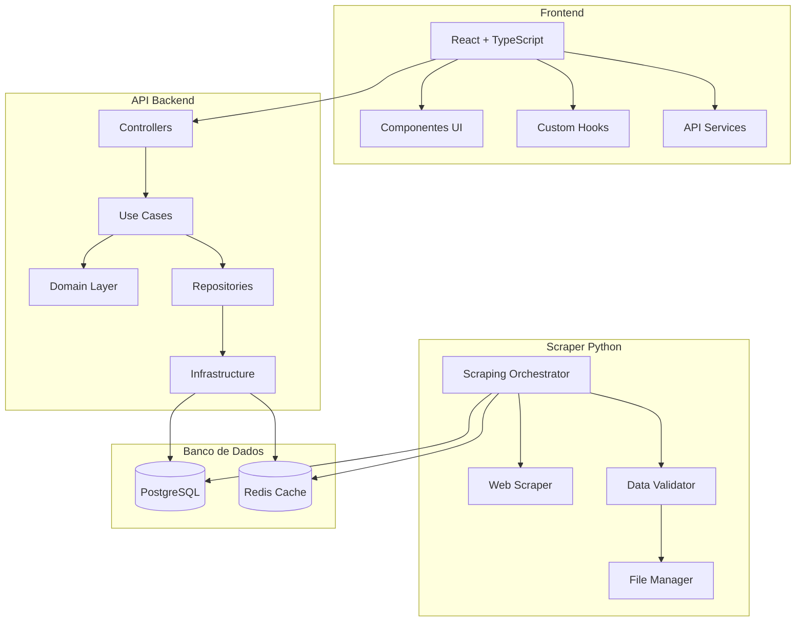
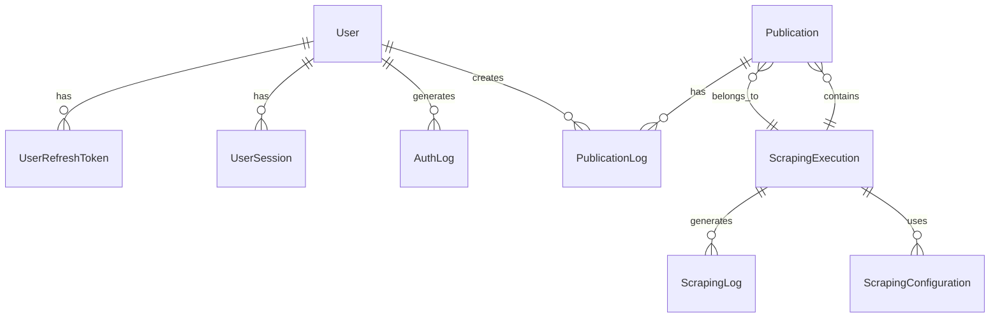

# 🔧 Documentação Técnica - JusCash

> Sistema de Gerenciamento de Publicações do Diário da Justiça Eletrônico (DJE-SP)  
> Documentação Técnica Completa para Desenvolvedores e Administradores

---

## 📖 Índice

1. [Visão Geral da Arquitetura](#visão-geral-da-arquitetura)
2. [Tecnologias Utilizadas](#tecnologias-utilizadas)
3. [Estrutura do Projeto](#estrutura-do-projeto)
4. [API REST](#api-rest)
5. [Banco de Dados](#banco-de-dados)
6. [Sistema de Scraping](#sistema-de-scraping)
7. [Frontend React](#frontend-react)
8. [Infraestrutura e DevOps](#infraestrutura-e-devops)
9. [Segurança](#segurança)
10. [Monitoramento e Logs](#monitoramento-e-logs)
11. [Instalação e Configuração](#instalação-e-configuração)
12. [Guias de Desenvolvimento](#guias-de-desenvolvimento)

---

## 🏗️ Visão Geral da Arquitetura

### Arquitetura do Sistema

O JusCash foi desenvolvido seguindo os princípios de **Clean Architecture** (Arquitetura Hexagonal), garantindo:

- **Separação clara de responsabilidades**
- **Independência de frameworks**
- **Testabilidade**
- **Flexibilidade para mudanças**
- **Escalabilidade**



### Princípios Arquiteturais

#### 1. Clean Architecture (Backend)
- **Domain Layer**: Entidades, regras de negócio e contratos
- **Application Layer**: Casos de uso e orquestração
- **Infrastructure Layer**: Implementações técnicas
- **Web Layer**: Controllers, middlewares e rotas

#### 2. Component-Based Architecture (Frontend)
- **Componentes Reutilizáveis**: UI components isolados
- **Custom Hooks**: Lógica compartilhada
- **Context API**: Gerenciamento de estado global
- **Service Layer**: Comunicação com API

#### 3. Hexagonal Architecture (Scraper)
- **Portas e Adaptadores**: Interfaces bem definidas
- **Domínio Isolado**: Lógica de negócio independente
- **Adaptadores**: Implementações específicas

---

## 💻 Tecnologias Utilizadas

### Backend (Node.js)

| Tecnologia | Versão | Propósito |
|------------|--------|-----------|
| **Node.js** | 20+ | Runtime JavaScript |
| **Express.js** | 5.x | Framework web |
| **TypeScript** | 5.x | Tipagem estática |
| **Prisma ORM** | 5.x | Object-Relational Mapping |
| **JWT** | 9.x | Autenticação |
| **Zod** | 3.x | Validação de schemas |
| **Winston** | 3.x | Sistema de logs |
| **bcrypt** | 5.x | Hash de senhas |
| **Helmet** | 7.x | Segurança HTTP |
| **CORS** | 2.x | Cross-Origin Resource Sharing |

### Frontend (React)

| Tecnologia | Versão | Propósito |
|------------|--------|-----------|
| **React** | 18.x | Framework UI |
| **TypeScript** | 5.x | Tipagem estática |
| **Vite** | 5.x | Build tool |
| **Tailwind CSS** | 3.x | Framework CSS |
| **Lucide React** | 0.x | Ícones |
| **React Hook Form** | 7.x | Gerenciamento de formulários |
| **React DnD** | 16.x | Drag and Drop |
| **Axios** | 1.x | Cliente HTTP |

### Scraper (Python)

| Tecnologia | Versão | Propósito |
|------------|--------|-----------|
| **Python** | 3.11+ | Runtime |
| **Playwright** | 1.x | Automação web |
| **SQLAlchemy** | 2.x | ORM Python |
| **Pydantic** | 2.x | Validação de dados |
| **APScheduler** | 3.x | Agendamento de tarefas |
| **Loguru** | 0.x | Sistema de logs |
| **Redis** | 4.x | Cache e filas |
| **Requests** | 2.x | Cliente HTTP |

### Banco de Dados

| Tecnologia | Versão | Propósito |
|------------|--------|-----------|
| **PostgreSQL** | 16+ | Banco relacional |
| **Redis** | 7+ | Cache e sessões |

### DevOps e Infraestrutura

| Tecnologia | Versão | Propósito |
|------------|--------|-----------|
| **Docker** | 24+ | Containerização |
| **Docker Compose** | 2.x | Orquestração local |
| **Nginx** | 1.x | Proxy reverso |
| **Git** | 2.x | Controle de versão |

---

## 📁 Estrutura do Projeto

### Estrutura Geral

```
juscash/
├── backend/
│   ├── api/                    # API REST Node.js
│   └── scraper/               # Sistema de scraping Python
├── frontend/                  # Interface React
├── database/                  # Configurações de banco
├── docs/                      # Documentação
├── scripts/                   # Scripts utilitários
├── docker-compose.yml         # Orquestração Docker
└── README.md                  # Documentação principal
```

### Backend API (Node.js)

```
backend/api/
├── src/
│   ├── domain/               # Camada de domínio
│   │   ├── entities/         # Entidades do negócio
│   │   ├── repositories/     # Contratos dos repositórios
│   │   └── services/         # Serviços de domínio
│   ├── application/          # Camada de aplicação
│   │   └── usecases/         # Casos de uso
│   ├── infrastructure/       # Camada de infraestrutura
│   │   ├── database/         # Adaptadores Prisma
│   │   ├── security/         # JWT e autenticação
│   │   └── web/             # Controllers e rotas
│   └── shared/              # Código compartilhado
│       ├── config/          # Configurações
│       ├── utils/           # Utilitários
│       └── validation/      # Schemas Zod
├── prisma/                  # Schema e migrações
├── tests/                   # Testes automatizados
└── package.json             # Dependências Node.js
```

### Scraper Python

```
backend/scraper/
├── src/
│   ├── domain/              # Camada de domínio
│   │   ├── entities/        # Entidades do scraping
│   │   ├── ports/           # Interfaces/contratos
│   │   └── services/        # Serviços de domínio
│   ├── application/         # Camada de aplicação
│   │   ├── services/        # Orquestração
│   │   └── usecases/        # Casos de uso
│   ├── infrastructure/      # Camada de infraestrutura
│   │   ├── web/            # Adaptadores web
│   │   ├── database/       # Adaptadores banco
│   │   ├── files/          # Gerenciamento arquivos
│   │   └── monitoring/     # Monitoramento
│   └── main.py             # Ponto de entrada
├── requirements.txt         # Dependências Python
└── config/                 # Configurações
```

### Frontend React

```
frontend/
├── src/
│   ├── components/          # Componentes UI
│   │   ├── ui/             # Componentes base
│   │   ├── KanbanBoard.tsx # Board principal
│   │   └── ...
│   ├── pages/              # Páginas da aplicação
│   ├── services/           # Serviços API
│   ├── hooks/              # Custom hooks
│   ├── contexts/           # Contextos React
│   ├── types/              # Definições TypeScript
│   └── lib/                # Utilitários
├── public/                 # Arquivos estáticos
└── package.json            # Dependências React
```

---

## 🌐 API REST

### Documentação Swagger/OpenAPI

A API possui documentação completa Swagger disponível em:
- **Local**: `http://localhost:3001/api-docs`
- **Produção**: `https://[seu-dominio]/api-docs`

### Endpoints Principais

#### Autenticação

##### POST `/api/auth/register`
Registra um novo usuário no sistema.

**Request Body:**
```json
{
  "name": "João Silva",
  "email": "joao@exemplo.com",
  "password": "MinhaSenh@123"
}
```

**Response (201):**
```json
{
  "success": true,
  "data": {
    "user": {
      "id": "cm123456789",
      "name": "João Silva",
      "email": "joao@exemplo.com",
      "isActive": true,
      "createdAt": "2024-01-15T10:30:00.000Z"
    },
    "tokens": {
      "accessToken": "eyJhbGciOiJIUzI1NiIsInR5cCI6IkpXVCJ9...",
      "refreshToken": "eyJhbGciOiJIUzI1NiIsInR5cCI6IkpXVCJ9..."
    }
  },
  "message": "Usuário registrado com sucesso"
}
```

##### POST `/api/auth/login`
Autentica um usuário existente.

**Request Body:**
```json
{
  "email": "joao@exemplo.com",
  "password": "MinhaSenh@123"
}
```

**Response (200):**
```json
{
  "success": true,
  "data": {
    "user": {
      "id": "cm123456789",
      "name": "João Silva",
      "email": "joao@exemplo.com",
      "isActive": true
    },
    "tokens": {
      "accessToken": "eyJhbGciOiJIUzI1NiIsInR5cCI6IkpXVCJ9...",
      "refreshToken": "eyJhbGciOiJIUzI1NiIsInR5cCI6IkpXVCJ9..."
    }
  },
  "message": "Login realizado com sucesso"
}
```

##### POST `/api/auth/refresh`
Renova o token de acesso usando o refresh token.

**Request Body:**
```json
{
  "refreshToken": "eyJhbGciOiJIUzI1NiIsInR5cCI6IkpXVCJ9..."
}
```

##### POST `/api/auth/logout`
Realiza logout invalidando o refresh token.

#### Publicações

##### GET `/api/publications`
Lista publicações com paginação e filtros.

**Query Parameters:**
- `page` (number): Página (padrão: 1)
- `limit` (number): Itens por página (padrão: 20, máx: 100)
- `status` (enum): Filtro por status
- `search` (string): Busca por texto
- `processNumber` (string): Filtro por número do processo
- `startDate` (date): Data inicial
- `endDate` (date): Data final
- `authors` (string): Filtro por autores
- `defendant` (string): Filtro por réu

**Response (200):**
```json
{
  "success": true,
  "data": [
    {
      "id": "cm123456789",
      "processNumber": "1234567-89.2023.4.03.6100",
      "publicationDate": "2023-12-15",
      "availabilityDate": "2023-12-16",
      "authors": ["João Silva", "Maria Santos"],
      "defendant": "Instituto Nacional do Seguro Social - INSS",
      "grossValue": 50000,
      "netValue": 45000,
      "interestValue": 5000,
      "attorneyFees": 10000,
      "content": "Conteúdo da publicação...",
      "status": "NOVA",
      "createdAt": "2023-12-16T08:00:00.000Z",
      "updatedAt": "2023-12-16T08:00:00.000Z"
    }
  ],
  "pagination": {
    "page": 1,
    "limit": 20,
    "total": 150,
    "totalPages": 8,
    "hasNext": true,
    "hasPrev": false
  }
}
```

##### GET `/api/publications/:id`
Busca uma publicação específica por ID.

**Response (200):**
```json
{
  "success": true,
  "data": {
    "id": "cm123456789",
    "processNumber": "1234567-89.2023.4.03.6100",
    "publicationDate": "2023-12-15",
    "availabilityDate": "2023-12-16",
    "authors": ["João Silva", "Maria Santos"],
    "defendant": "Instituto Nacional do Seguro Social - INSS",
    "lawyers": {
      "author": ["Dr. João Advogado - OAB/SP 123456"],
      "defendant": ["Dr. Maria Procuradora - OAB/SP 654321"]
    },
    "grossValue": 50000,
    "netValue": 45000,
    "interestValue": 5000,
    "attorneyFees": 10000,
    "content": "Conteúdo completo da publicação...",
    "status": "NOVA",
    "scrapingSource": "DJE-SP",
    "caderno": "3",
    "instancia": "1",
    "local": "Capital",
    "parte": "1",
    "extractionMetadata": {
      "extractedAt": "2023-12-16T08:00:00.000Z",
      "source": "automated_scraping",
      "confidence": 0.95
    },
    "createdAt": "2023-12-16T08:00:00.000Z",
    "updatedAt": "2023-12-16T08:00:00.000Z"
  }
}
```

##### PUT `/api/publications/:id/status`
Atualiza o status de uma publicação.

**Request Body:**
```json
{
  "status": "LIDA",
  "notes": "Publicação analisada e aprovada para próxima etapa"
}
```

**Response (200):**
```json
{
  "success": true,
  "data": {
    "id": "cm123456789",
    "status": "LIDA",
    "updatedAt": "2023-12-16T14:30:00.000Z"
  },
  "message": "Status atualizado com sucesso"
}
```

#### Métricas e Saúde

##### GET `/api/health`
Verifica a saúde do sistema.

**Response (200):**
```json
{
  "success": true,
  "data": {
    "status": "healthy",
    "timestamp": "2023-12-16T14:30:00.000Z",
    "uptime": 86400,
    "version": "1.0.0",
    "services": {
      "database": "connected",
      "redis": "connected"
    },
    "metrics": {
      "totalPublications": 1500,
      "todayPublications": 25,
      "activeUsers": 5
    }
  }
}
```

##### GET `/api/metrics`
Retorna métricas detalhadas do sistema.

### Middlewares

#### 1. Autenticação (authMiddleware)
- Valida JWT tokens
- Verifica se usuário está ativo
- Adiciona dados do usuário ao request

#### 2. Rate Limiting (rateLimitMiddleware)
- Limita requisições por IP/usuário
- Configurável por endpoint
- Padrão: 100 req/15min

#### 3. Validação (validationMiddleware)
- Valida request body com schemas Zod
- Sanitiza dados de entrada
- Retorna erros formatados

#### 4. Logging (loggingMiddleware)
- Registra todas as requisições
- Inclui timing e status codes
- Logs estruturados com Winston

#### 5. Segurança (securityMiddleware)
- Headers de segurança (Helmet)
- Proteção CORS
- Sanitização XSS

### Tratamento de Erros

```typescript
// Estrutura padrão de erro
{
  "success": false,
  "error": {
    "code": "VALIDATION_ERROR",
    "message": "Dados inválidos fornecidos",
    "details": [
      {
        "field": "email",
        "message": "Email deve ser válido"
      }
    ]
  },
  "timestamp": "2023-12-16T14:30:00.000Z",
  "path": "/api/auth/register"
}
```

#### Códigos de Erro HTTP

| Código | Descrição | Uso |
|--------|-----------|-----|
| 400 | Bad Request | Dados inválidos ou malformados |
| 401 | Unauthorized | Token inválido ou expirado |
| 403 | Forbidden | Usuário sem permissão |
| 404 | Not Found | Recurso não encontrado |
| 409 | Conflict | Conflito de dados (ex: email já existe) |
| 422 | Unprocessable Entity | Dados válidos mas regra de negócio violada |
| 429 | Too Many Requests | Rate limit excedido |
| 500 | Internal Server Error | Erro interno do servidor |

---

## 🗄️ Banco de Dados

### Schema do PostgreSQL

#### Diagrama de Relacionamentos



#### Tabelas Principais

##### users
Tabela central de usuários do sistema.

```sql
CREATE TABLE users (
    id VARCHAR PRIMARY KEY,              -- CUID2
    name VARCHAR NOT NULL,               -- Nome completo
    email VARCHAR UNIQUE NOT NULL,       -- Email único
    password_hash VARCHAR NOT NULL,      -- Hash bcrypt da senha
    last_password_change TIMESTAMP,     -- Última alteração de senha
    is_password_temporary BOOLEAN DEFAULT true, -- Senha temporária
    is_active BOOLEAN DEFAULT true,     -- Usuário ativo
    created_at TIMESTAMP DEFAULT NOW(), -- Data de criação
    updated_at TIMESTAMP DEFAULT NOW(), -- Última atualização
    deactivated_at TIMESTAMP           -- Data de desativação
);

-- Índices para performance
CREATE INDEX idx_users_email ON users(email);
CREATE INDEX idx_users_created_at ON users(created_at);
CREATE INDEX idx_users_active ON users(is_active, created_at);
```

##### publications
Tabela principal de publicações do DJE.

```sql
CREATE TABLE publications (
    id VARCHAR PRIMARY KEY,              -- CUID2
    process_number VARCHAR UNIQUE NOT NULL, -- Número CNJ do processo
    publication_date DATE,               -- Data oficial da publicação
    availability_date DATE,              -- Data de disponibilização
    authors TEXT[] NOT NULL,             -- Array de autores
    defendant VARCHAR DEFAULT 'Instituto Nacional do Seguro Social - INSS',
    lawyers JSONB,                       -- Advogados estruturados
    gross_value BIGINT,                  -- Valor bruto em centavos
    net_value BIGINT,                    -- Valor líquido em centavos
    interest_value BIGINT,               -- Valor de juros em centavos
    attorney_fees BIGINT,                -- Honorários em centavos
    content TEXT NOT NULL,               -- Conteúdo completo
    status publication_status DEFAULT 'NOVA', -- Status do workflow
    created_at TIMESTAMP DEFAULT NOW(), -- Data de criação
    updated_at TIMESTAMP DEFAULT NOW(), -- Última atualização
    scraping_source VARCHAR DEFAULT 'DJE-SP', -- Fonte do scraping
    caderno VARCHAR DEFAULT '3',         -- Caderno do DJE
    instancia VARCHAR DEFAULT '1',       -- Instância judicial
    local VARCHAR DEFAULT 'Capital',     -- Local da publicação
    parte VARCHAR DEFAULT '1',           -- Parte do processo
    extraction_metadata JSONB,          -- Metadados da extração
    scraping_execution_id VARCHAR       -- FK para execução do scraping
);

-- Índices otimizados
CREATE INDEX idx_publications_process_number ON publications(process_number);
CREATE INDEX idx_publications_status ON publications(status);
CREATE INDEX idx_publications_availability_date ON publications(availability_date);
CREATE INDEX idx_publications_created_at ON publications(created_at);
CREATE INDEX idx_publications_status_date ON publications(status, availability_date);
CREATE INDEX idx_publications_source_caderno ON publications(scraping_source, caderno);
CREATE INDEX idx_publications_defendant ON publications(defendant);

-- Índice para busca textual
CREATE INDEX idx_publications_content_search ON publications 
USING gin(to_tsvector('portuguese', content));

-- Índice para busca em autores
CREATE INDEX idx_publications_authors ON publications USING gin(authors);
```

##### scraping_executions
Registra execuções do sistema de scraping.

```sql
CREATE TABLE scraping_executions (
    id UUID PRIMARY KEY DEFAULT gen_random_uuid(),
    execution_type scraping_execution_type NOT NULL, -- SCHEDULED, MANUAL, TEST
    status scraping_execution_status DEFAULT 'RUNNING', -- RUNNING, SUCCESS, FAILED
    started_at TIMESTAMP DEFAULT NOW(),
    finished_at TIMESTAMP,
    execution_time_seconds INTEGER,
    publications_found INTEGER DEFAULT 0,
    publications_new INTEGER DEFAULT 0,
    publications_duplicated INTEGER DEFAULT 0,
    publications_failed INTEGER DEFAULT 0,
    publications_saved INTEGER DEFAULT 0,
    criteria_used JSONB,                 -- Critérios utilizados
    max_publications_limit INTEGER,     -- Limite máximo configurado
    scraper_version VARCHAR,             -- Versão do scraper
    browser_user_agent VARCHAR,         -- User agent utilizado
    error_details JSONB                  -- Detalhes de erros
);

-- Índices para relatórios
CREATE INDEX idx_scraping_executions_type_date ON scraping_executions(execution_type, started_at);
CREATE INDEX idx_scraping_executions_status_date ON scraping_executions(status, started_at);
```

##### publication_logs
Auditoria de ações nas publicações.

```sql
CREATE TABLE publication_logs (
    id VARCHAR PRIMARY KEY,
    publication_id VARCHAR NOT NULL,
    user_id VARCHAR NOT NULL,
    action publication_log_action NOT NULL, -- VIEW, STATUS_CHANGE, EDIT, etc.
    old_data JSONB,                      -- Estado anterior
    new_data JSONB,                      -- Estado novo
    notes TEXT,                          -- Observações
    created_at TIMESTAMP DEFAULT NOW(),
    
    FOREIGN KEY (publication_id) REFERENCES publications(id),
    FOREIGN KEY (user_id) REFERENCES users(id)
);

-- Índices para auditoria
CREATE INDEX idx_publication_logs_publication_date ON publication_logs(publication_id, created_at);
CREATE INDEX idx_publication_logs_user_date ON publication_logs(user_id, created_at);
CREATE INDEX idx_publication_logs_action_date ON publication_logs(action, created_at);
```

#### Enums Principais

```sql
-- Status das publicações
CREATE TYPE publication_status AS ENUM (
    'NOVA',
    'LIDA', 
    'ENVIADA_PARA_ADV',
    'CONCLUIDA'
);

-- Tipos de execução do scraping
CREATE TYPE scraping_execution_type AS ENUM (
    'SCHEDULED',
    'MANUAL',
    'TEST'
);

-- Status da execução do scraping
CREATE TYPE scraping_execution_status AS ENUM (
    'RUNNING',
    'SUCCESS',
    'FAILED',
    'CANCELLED'
);

-- Ações de log das publicações
CREATE TYPE publication_log_action AS ENUM (
    'VIEW',
    'STATUS_CHANGE',
    'EDIT',
    'CREATE',
    'DELETE'
);
```

### Estratégias de Performance

#### 1. Indexação Inteligente
- Índices compostos para consultas frequentes
- Índices GIN para arrays e busca textual
- Índices parciais para dados ativos

#### 2. Particionamento
```sql
-- Particionamento por data para publicações antigas
CREATE TABLE publications_2023 PARTITION OF publications
FOR VALUES FROM ('2023-01-01') TO ('2024-01-01');

CREATE TABLE publications_2024 PARTITION OF publications
FOR VALUES FROM ('2024-01-01') TO ('2025-01-01');
```

#### 3. Otimizações de Query
- LIMIT com OFFSET otimizado para paginação
- Cursor-based pagination para grandes datasets
- Query planning para consultas complexas

#### 4. Connection Pooling
```typescript
// Configuração Prisma
{
  datasource: {
    provider: "postgresql",
    url: env("DATABASE_URL")
  },
  generator: {
    provider: "prisma-client-js",
    output: "../src/generated/prisma"
  }
}

// Pool de conexões otimizado
const prisma = new PrismaClient({
  datasources: {
    db: {
      url: process.env.DATABASE_URL
    }
  },
  log: ['query', 'info', 'warn', 'error']
})
```

### Backup e Recuperação

#### 1. Backup Automático
```bash
#!/bin/bash
# Script de backup diário

DB_NAME="juscash_db"
BACKUP_DIR="/backups/postgresql"
DATE=$(date +%Y%m%d_%H%M%S)

# Backup completo
pg_dump -h localhost -U postgres $DB_NAME > $BACKUP_DIR/full_backup_$DATE.sql

# Compactação
gzip $BACKUP_DIR/full_backup_$DATE.sql

# Manter apenas últimos 30 dias
find $BACKUP_DIR -name "full_backup_*.sql.gz" -mtime +30 -delete
```

#### 2. Point-in-Time Recovery
- WAL archiving habilitado
- Backup incremental contínuo
- Restore para momento específico

#### 3. Replicação
- Streaming replication para read replicas
- Failover automático configurado
- Monitoramento de lag de replicação

---

*Continua na próxima parte...* 