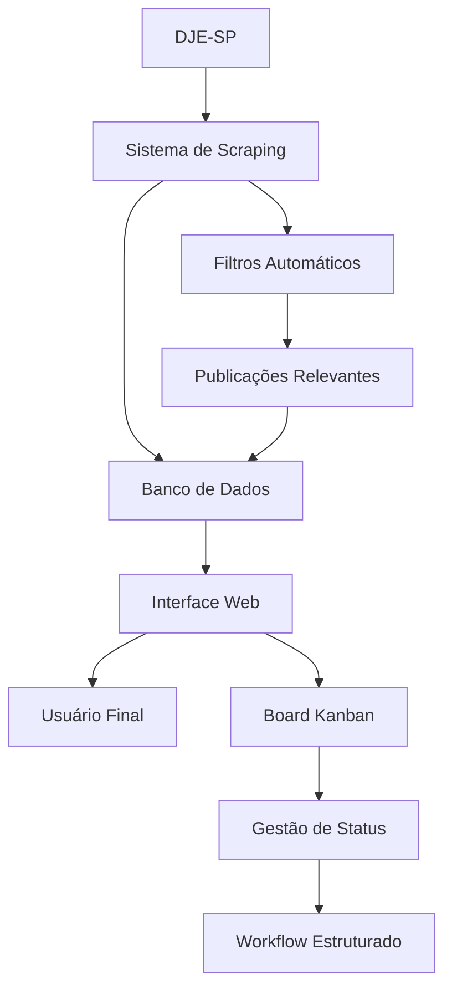
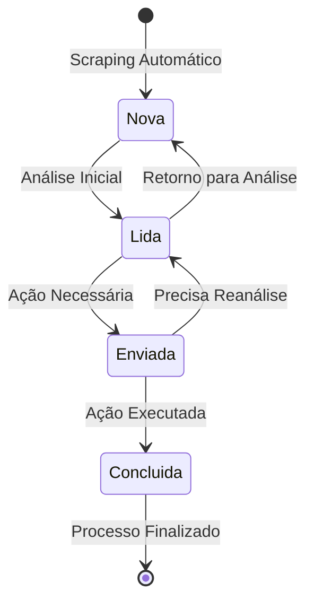

# 📋 Manual de Produto - JusCash

> Sistema de Gerenciamento de Publicações do Diário da Justiça Eletrônico (DJE-SP)

---

## 📖 Índice

1. [Introdução](#introdução)
2. [Visão Geral do Sistema](#visão-geral-do-sistema)
3. [Acesso ao Sistema](#acesso-ao-sistema)
4. [Funcionalidades Principais](#funcionalidades-principais)
5. [Manual de Uso](#manual-de-uso)
6. [Fluxo de Trabalho](#fluxo-de-trabalho)
7. [Filtros e Buscas](#filtros-e-buscas)
8. [Gerenciamento de Status](#gerenciamento-de-status)
9. [FAQ e Solução de Problemas](#faq-e-solução-de-problemas)
10. [Suporte Técnico](#suporte-técnico)

---

## 🎯 Introdução

### O que é o JusCash?

O **JusCash** é um sistema moderno e intuitivo para gerenciamento automatizado de publicações do Diário da Justiça Eletrônico de São Paulo (DJE-SP). Desenvolvido especificamente para advogados e escritórios jurídicos, o sistema automatiza a coleta, organização e acompanhamento de publicações relevantes.

### Benefícios do Sistema

- ✅ **Automação Completa**: Coleta automática de publicações do DJE-SP
- ✅ **Interface Intuitiva**: Board visual tipo Kanban para fácil gerenciamento
- ✅ **Filtros Avançados**: Busca inteligente por critérios específicos
- ✅ **Workflow Otimizado**: Fluxo de trabalho estruturado para maior produtividade
- ✅ **Acesso Seguro**: Sistema de autenticação e controle de acesso
- ✅ **Histórico Completo**: Auditoria de todas as ações realizadas

---

## 🌍 Visão Geral do Sistema

### Componentes Principais

O JusCash é composto por três módulos integrados:

1. **Sistema de Scraping Automatizado**
   - Coleta diária automática de publicações do DJE-SP
   - Filtragem inteligente baseada em critérios pré-configurados
   - Processamento e estruturação dos dados coletados

2. **Interface Web de Gerenciamento**
   - Board Kanban para visualização e organização
   - Sistema de filtros e busca avançada
   - Gerenciamento de status das publicações

3. **API de Integração**
   - Interface programática para integrações externas
   - Sistema de autenticação JWT
   - Endpoints RESTful para todas as operações

### Fluxo Operacional



---

## 🔐 Acesso ao Sistema

### Primeiro Acesso

1. **Cadastro de Usuário**
   - Acesse a página de cadastro
   - Preencha os dados obrigatórios:
     - Nome completo
     - E-mail válido
     - Senha segura (mínimo 8 caracteres, com letras, números e símbolos)
   - Confirme o cadastro

2. **Login no Sistema**
   - Acesse a página de login
   - Insira seu e-mail e senha
   - O sistema gerará automaticamente tokens de acesso
   - Você será redirecionado para o dashboard principal

### Requisitos de Senha

Para garantir a segurança, as senhas devem conter:
- ✅ Mínimo de 8 caracteres
- ✅ Pelo menos 1 letra maiúscula
- ✅ Pelo menos 1 letra minúscula
- ✅ Pelo menos 1 número
- ✅ Pelo menos 1 caractere especial (@, #, $, %, etc.)

### Recuperação de Senha

Em caso de esquecimento da senha:
1. Clique em "Esqueci minha senha" na tela de login
2. Insira seu e-mail cadastrado
3. Siga as instruções enviadas por e-mail
4. Defina uma nova senha segura

---

## 🚀 Funcionalidades Principais

### 1. Dashboard Principal

O dashboard oferece uma visão completa do sistema:

- **Resumo Estatístico**: Números de publicações por status
- **Board Kanban**: Visualização organizada por colunas de status
- **Filtros Rápidos**: Acesso direto aos filtros mais utilizados
- **Barra de Pesquisa**: Busca rápida por texto ou número de processo

### 2. Board Kanban

O coração do sistema é o board visual com 4 colunas:

#### 📋 Nova Publicação
- Publicações recém-coletadas pelo sistema
- Status inicial de todas as publicações
- Requer primeira análise do usuário

#### 👀 Publicação Lida
- Publicações que foram visualizadas e analisadas
- Aguardando decisão sobre encaminhamento
- Pode retornar para "Nova" se necessário

#### 📤 Enviar para Advogado Responsável
- Publicações que requerem ação específica
- Encaminhamento para profissional responsável
- Controle de workflow interno

#### ✅ Concluído
- Publicações totalmente processadas
- Status final do processo
- Arquivo histórico para consultas

### 3. Sistema de Filtros

#### Filtros por Data
- **Data de Publicação**: Filtra pela data oficial no DJE
- **Data de Disponibilidade**: Filtra pela data de disponibilização
- **Período Personalizado**: Define intervalo específico

#### Filtros por Conteúdo
- **Número do Processo**: Busca exata por número CNJ
- **Texto Livre**: Busca em todo o conteúdo da publicação
- **Autores**: Filtra por nomes dos autores
- **Réu**: Busca por nome do réu (padrão: INSS)

#### Filtros por Status
- **Status Específico**: Visualiza apenas um status
- **Múltiplos Status**: Combina diferentes status
- **Histórico**: Inclui publicações arquivadas

#### Filtros por Valores
- **Valor Bruto**: Filtra por faixas de valores
- **Valor Líquido**: Considera descontos aplicados
- **Honorários**: Busca por valores de honorários advocatícios

---

## 📖 Manual de Uso

### Navegação Básica

1. **Acessar o Sistema**
   ```
   1. Abra seu navegador web
   2. Acesse: https://[seu-dominio]/juscash
   3. Faça login com suas credenciais
   4. Aguarde o carregamento do dashboard
   ```

2. **Navegar pelo Board**
   ```
   1. O board carrega automaticamente as publicações
   2. Use o scroll horizontal para ver todas as colunas
   3. Cada coluna mostra o total de publicações no topo
   4. Publicações são carregadas dinamicamente conforme o scroll
   ```

### Gerenciamento de Publicações

#### Visualizar Detalhes
1. Clique em qualquer card de publicação
2. Modal será aberto com informações completas:
   - Número do processo
   - Data de publicação e disponibilidade
   - Autores e réu
   - Valores (bruto, líquido, honorários)
   - Conteúdo completo da publicação
   - Histórico de alterações

#### Mover entre Status
1. **Arrastar e Soltar**:
   - Clique e segure o card da publicação
   - Arraste para a coluna de destino desejada
   - Solte o card na posição correta
   - O sistema valida automaticamente movimentos permitidos

2. **Menu de Contexto**:
   - Clique com botão direito no card
   - Selecione "Alterar Status"
   - Escolha o novo status na lista
   - Confirme a alteração

#### Regras de Movimentação
- ✅ **Nova → Lida**: Sempre permitido
- ✅ **Lida → Enviar para Advogado**: Sempre permitido
- ✅ **Enviar para Advogado → Concluído**: Sempre permitido
- ✅ **Enviar para Advogado → Lida**: Retorno permitido
- ❌ **Concluído → Outros**: Movimento bloqueado
- ❌ **Nova → Enviar para Advogado**: Deve passar por "Lida"

### Uso de Filtros

#### Aplicar Filtros Básicos
1. Localize a barra de filtros no topo da tela
2. Campos disponíveis:
   - **Busca por Texto**: Digite qualquer termo relevante
   - **Número do Processo**: Digite o número CNJ completo
   - **Data Inicial**: Selecione data de início
   - **Data Final**: Selecione data de fim
   - **Status**: Selecione um ou múltiplos status

3. Clique em "Aplicar Filtros" ou pressione Enter
4. O board será atualizado automaticamente

#### Filtros Avançados
1. Clique em "Filtros Avançados"
2. Configure critérios específicos:
   - **Autores**: Lista de nomes específicos
   - **Réu**: Nome do réu (padrão preenchido com INSS)
   - **Valores**: Faixas de valores monetários
   - **Caderno**: Caderno específico do DJE
   - **Instância**: Primeira ou segunda instância

3. Combine múltiplos filtros para buscas precisas
4. Salve filtros frequentes como "Favoritos"

#### Limpar Filtros
- Clique no botão "Limpar Filtros"
- Ou clique no "X" ao lado de cada filtro ativo
- O board retornará ao estado padrão

---

## 🔄 Fluxo de Trabalho

### Workflow Recomendado

#### 1. Análise Diária (Manhã)
```
1. Acesse o sistema
2. Verifique a coluna "Nova Publicação"
3. Analise cada publicação rapidamente
4. Mova publicações relevantes para "Lida"
5. Publicações irrelevantes podem permanecer em "Nova"
```

#### 2. Triagem Detalhada (Meio do Dia)
```
1. Foque na coluna "Publicação Lida"
2. Abra cada publicação para análise detalhada
3. Identifique ações necessárias
4. Mova para "Enviar para Advogado" quando aplicável
5. Adicione observações se necessário
```

#### 3. Acompanhamento de Execução (Tarde)
```
1. Monitore a coluna "Enviar para Advogado"
2. Verifique se ações foram executadas
3. Mova publicações finalizadas para "Concluído"
4. Retorne para "Lida" se precisar de nova análise
```

#### 4. Revisão Semanal
```
1. Use filtros por data para revisar a semana
2. Verifique se há publicações pendentes
3. Analise estatísticas de produtividade
4. Ajuste critérios de scraping se necessário
```

### Boas Práticas

#### Organização
- ✅ Mantenha a coluna "Nova" sempre atualizada
- ✅ Use filtros para focar em períodos específicos
- ✅ Processe publicações diariamente para evitar acúmulo
- ✅ Utilize o histórico para auditoria de ações

#### Produtividade
- ✅ Configure filtros favoritos para buscas frequentes
- ✅ Use atalhos de teclado quando disponíveis
- ✅ Aproveite a busca por texto para encontrar casos similares
- ✅ Monitore trends nos valores para identificar padrões

#### Qualidade
- ✅ Sempre abra publicações para análise detalhada antes de mover
- ✅ Verifique números de processo para evitar duplicações
- ✅ Confirme valores antes de processar
- ✅ Mantenha observações atualizadas nos cards

---

## 🔍 Filtros e Buscas

### Tipos de Busca

#### 1. Busca Simples (Texto Livre)
- **Funcionalidade**: Busca em todo o conteúdo da publicação
- **Uso**: Digite qualquer termo relevante
- **Exemplos**:
  - `"aposentadoria"` - encontra todas as publicações sobre aposentadoria
  - `"auxílio-doença"` - busca por auxílio-doença
  - `"João Silva"` - localiza por nome do autor

#### 2. Busca por Número do Processo
- **Funcionalidade**: Busca exata por número CNJ
- **Formato**: NNNNNNN-DD.AAAA.J.TR.OOOO
- **Exemplo**: `1234567-89.2023.4.03.6100`

#### 3. Busca por Data
- **Data de Publicação**: Data oficial no DJE
- **Data de Disponibilidade**: Data em que ficou disponível no sistema
- **Período**: Intervalo entre duas datas

#### 4. Busca por Valores
- **Valor Bruto**: Valor total antes de descontos
- **Valor Líquido**: Valor após descontos
- **Honorários**: Valores de honorários advocatícios
- **Formato**: Valores em reais (R$)

### Operadores de Busca

#### Operadores de Texto
- **Aspas duplas**: `"termo exato"` - busca a frase exata
- **E lógico**: `termo1 termo2` - ambos os termos devem estar presentes
- **OU lógico**: `termo1 OR termo2` - pelo menos um dos termos
- **Negação**: `-termo` - exclui publicações com o termo

#### Exemplos Práticos
```
"Instituto Nacional" aposentadoria    → Publicações sobre aposentadoria do INSS
"João Silva" -arquivado               → João Silva excluindo arquivados
valor:>5000 honorários:<1000          → Valor maior que R$ 5.000 e honorários menor que R$ 1.000
data:2023-12-01..2023-12-31          → Publicações de dezembro de 2023
```

### Filtros Salvos

#### Criar Filtro Favorito
1. Configure os filtros desejados
2. Clique em "Salvar Filtro"
3. Digite um nome descritivo
4. Confirme a criação

#### Gerenciar Filtros
- **Aplicar**: Clique no nome do filtro salvo
- **Editar**: Clique no ícone de edição
- **Excluir**: Clique no ícone de lixeira
- **Compartilhar**: Envie por email para outros usuários

---

## 📊 Gerenciamento de Status

### Estados das Publicações

#### 📋 Nova Publicação
**Características:**
- Status inicial de todas as publicações coletadas
- Requer primeira análise manual
- Cor: Azul claro

**Ações Possíveis:**
- Visualizar detalhes completos
- Mover para "Publicação Lida"
- Filtrar por critérios específicos
- Marcar como irrelevante (permanece em Nova)

**Indicadores:**
- Contador no topo da coluna
- Cards ordenados por data de publicação
- Scroll infinito para carregamento dinâmico

#### 👀 Publicação Lida
**Características:**
- Publicações já visualizadas e analisadas
- Aguardando decisão sobre próximos passos
- Cor: Amarelo claro

**Ações Possíveis:**
- Mover para "Enviar para Advogado Responsável"
- Retornar para "Nova Publicação" se necessário
- Adicionar observações internas
- Marcar como baixa prioridade

**Indicadores:**
- Data da última visualização
- Usuário responsável pela análise
- Tempo desde a análise

#### 📤 Enviar para Advogado Responsável
**Características:**
- Publicações que requerem ação jurídica específica
- Em processo de encaminhamento ou execução
- Cor: Laranja claro

**Ações Possíveis:**
- Mover para "Concluído" após execução
- Retornar para "Publicação Lida" se necessário
- Atribuir a advogado específico
- Definir prazo para execução

**Indicadores:**
- Advogado responsável atribuído
- Data de encaminhamento
- Prazo para conclusão

#### ✅ Concluído
**Características:**
- Publicações totalmente processadas
- Status final do workflow
- Cor: Verde claro

**Ações Possíveis:**
- Visualizar histórico completo
- Gerar relatórios
- Consultar para casos similares
- Arquivar permanentemente

**Indicadores:**
- Data de conclusão
- Usuário responsável pela finalização
- Resultado final (sucesso/insucesso)

### Transições de Status

#### Regras de Movimentação



#### Validações Automáticas
- **Movimentos Obrigatórios**: Nova → Lida → Enviada → Concluída
- **Retornos Permitidos**: Enviada → Lida, Lida → Nova
- **Bloqueios**: Concluída não permite movimentos
- **Validação de Usuário**: Verifica permissões antes de mover

### Auditoria de Status

#### Histórico de Alterações
Cada mudança de status é registrada com:
- **Data e Hora**: Timestamp preciso da alteração
- **Usuário**: Quem realizou a mudança
- **Status Anterior**: Estado antes da alteração
- **Status Novo**: Estado após a alteração
- **Observações**: Comentários adicionais se aplicável

#### Relatórios de Workflow
- **Tempo por Status**: Quanto tempo as publicações ficam em cada estado
- **Produtividade por Usuário**: Quantas publicações cada usuário processa
- **Gargalos**: Identificação de etapas mais demoradas
- **Tendências**: Análise de padrões ao longo do tempo

---

## ❓ FAQ e Solução de Problemas

### Perguntas Frequentes

#### 1. **O sistema não está carregando as publicações**
**Possíveis Causas:**
- Conexão com internet instável
- Servidor temporariamente indisponível
- Cache do navegador desatualizado

**Soluções:**
1. Verifique sua conexão com a internet
2. Atualize a página (F5 ou Ctrl+R)
3. Limpe o cache do navegador
4. Tente acessar em modo privado/incógnito
5. Contate o suporte se o problema persistir

#### 2. **Não consigo mover publicações entre colunas**
**Possíveis Causas:**
- Movimento não permitido pelas regras de negócio
- Problema de permissão de usuário
- Erro temporário de interface

**Soluções:**
1. Verifique se o movimento é permitido (consulte as regras)
2. Tente usar o menu de contexto (botão direito)
3. Recarregue a página e tente novamente
4. Verifique se você tem permissão para alterar status

#### 3. **Os filtros não estão funcionando**
**Possíveis Causas:**
- Sintaxe incorreta nos filtros
- Dados não existem no período filtrado
- Cache desatualizado

**Soluções:**
1. Limpe todos os filtros e aplique novamente
2. Verifique a sintaxe dos filtros (datas, valores)
3. Tente filtrar por períodos maiores
4. Recarregue a página

#### 4. **Não recebo notificações de novas publicações**
**Possíveis Causas:**
- Notificações desabilitadas no navegador
- Sistema de scraping pausado
- Critérios muito restritivos

**Soluções:**
1. Habilite notificações do navegador
2. Verifique se o sistema de scraping está ativo
3. Revise os critérios de filtragem automática
4. Contate o administrador do sistema

#### 5. **O sistema está lento**
**Possíveis Causas:**
- Grande volume de dados carregados
- Conexão lenta
- Servidor sobrecarregado

**Soluções:**
1. Use filtros para reduzir o volume de dados
2. Feche outras abas/aplicações
3. Verifique sua velocidade de internet
4. Aguarde horários de menor movimento
5. Limpe o cache do navegador

### Códigos de Erro Comuns

#### Erro 401 - Não Autorizado
- **Significado**: Sua sessão expirou ou credenciais são inválidas
- **Solução**: Faça logout e login novamente

#### Erro 403 - Acesso Negado
- **Significado**: Você não tem permissão para esta ação
- **Solução**: Contate o administrador para verificar suas permissões

#### Erro 404 - Não Encontrado
- **Significado**: A publicação ou página solicitada não existe
- **Solução**: Verifique se o item não foi removido ou se a URL está correta

#### Erro 429 - Muitas Requisições
- **Significado**: Você está fazendo muitas operações muito rapidamente
- **Solução**: Aguarde alguns segundos e tente novamente

#### Erro 500 - Erro do Servidor
- **Significado**: Problema interno do servidor
- **Solução**: Tente novamente em alguns minutos ou contate o suporte

### Problemas de Performance

#### Carregamento Lento
**Otimizações:**
1. Use filtros para limitar resultados
2. Evite períodos muito amplos
3. Feche abas desnecessárias do navegador
4. Verifique plugins/extensões que podem interferir

#### Alto Uso de Memória
**Soluções:**
1. Recarregue a página periodicamente
2. Limite o número de publicações carregadas
3. Use filtros específicos
4. Feche e reabra o navegador se necessário

---

## 🆘 Suporte Técnico

### Canais de Suporte

#### 1. **Suporte Online**
- **Portal de Ajuda**: https://[seu-dominio]/help
- **Chat em Tempo Real**: Disponível no sistema durante horário comercial
- **Base de Conhecimento**: Artigos e tutoriais atualizados

#### 2. **Suporte por Email**
- **Email Geral**: suporte@juscash.com
- **Email Técnico**: tecnico@juscash.com
- **Tempo de Resposta**: 24-48 horas em dias úteis

#### 3. **Suporte por Telefone**
- **Telefone**: (11) 9999-9999
- **Horário**: Segunda a Sexta, 8h às 18h
- **WhatsApp Business**: (11) 9999-9999

### Informações para Suporte

Ao contatar o suporte, tenha em mãos:

#### Informações Básicas
- **Nome de Usuário**: Seu email de login
- **Navegador Utilizado**: Chrome, Firefox, Safari, etc.
- **Versão do Navegador**: Pode ser encontrada nas configurações
- **Sistema Operacional**: Windows, macOS, Linux

#### Descrição do Problema
- **O que você estava fazendo**: Ação específica que gerou o problema
- **Mensagem de Erro**: Texto exato ou screenshot do erro
- **Quando Ocorreu**: Data e horário aproximado
- **Frequência**: Se é um problema recorrente ou isolado

#### Screenshots e Logs
- **Screenshot da Tela**: Capture a tela mostrando o problema
- **Log do Navegador**: Pressione F12 → Console → Copie mensagens de erro
- **URL da Página**: Endereço completo onde ocorreu o problema

### Horários de Atendimento

#### Suporte Padrão
- **Segunda a Sexta**: 8h às 18h
- **Sábado**: 8h às 12h
- **Domingo e Feriados**: Sem atendimento

#### Suporte de Emergência
- **Disponibilidade**: 24/7 para problemas críticos
- **Contato**: emergencia@juscash.com
- **Telefone**: (11) 9999-9999 (WhatsApp)

#### SLA - Acordo de Nível de Serviço
- **Problemas Críticos**: Resposta em até 2 horas
- **Problemas Altos**: Resposta em até 8 horas
- **Problemas Médios**: Resposta em até 24 horas
- **Problemas Baixos**: Resposta em até 72 horas

### Treinamento e Capacitação

#### Treinamento Inicial
- **Duração**: 2 horas
- **Modalidade**: Online ou presencial
- **Conteúdo**: Funcionalidades básicas e workflow
- **Material**: Manual digital e vídeos

#### Treinamento Avançado
- **Duração**: 4 horas
- **Modalidade**: Online ou presencial
- **Conteúdo**: Filtros avançados, relatórios, integrações
- **Material**: Documentação técnica completa

#### Webinars Mensais
- **Frequência**: Primeira sexta-feira do mês
- **Horário**: 14h às 15h
- **Conteúdo**: Novidades, dicas e boas práticas
- **Inscrição**: Gratuita pelo portal

---

## 📄 Informações Legais

### Versão do Documento
- **Versão**: 1.0
- **Data**: Janeiro 2024
- **Responsável**: Equipe JusCash
- **Revisão**: Mensal

### Direitos Autorais
© 2024 JusCash. Todos os direitos reservados. 

Este manual é propriedade exclusiva da JusCash e não pode ser reproduzido, distribuído ou modificado sem autorização expressa por escrito.

### Política de Privacidade
O JusCash está comprometido com a proteção de dados pessoais conforme a Lei Geral de Proteção de Dados (LGPD). Para mais informações, consulte nossa Política de Privacidade completa em https://[seu-dominio]/privacy.

### Termos de Uso
O uso do sistema JusCash está sujeito aos Termos de Uso disponíveis em https://[seu-dominio]/terms. É responsabilidade do usuário conhecer e cumprir estes termos.

---

*Fim do Manual de Produto JusCash*

**Para mais informações, visite: https://[seu-dominio]**  
**Suporte técnico: suporte@juscash.com**  
**Telefone: (11) 9999-9999**