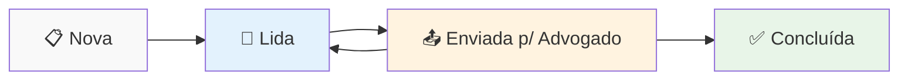

# ⚛️ Frontend JusCash - Interface Kanban

> Interface React moderna para gerenciamento de publicações DJE com sistema Kanban intuitivo

## 🎯 **Overview**

O frontend do JusCash é uma aplicação React moderna que oferece uma interface visual intuitiva para gerenciar publicações do Diário da Justiça Eletrônico através de um sistema Kanban drag-and-drop.

### ✨ **Funcionalidades Principais**

- 🎨 **Interface Kanban** com drag-and-drop
- 🔐 **Autenticação JWT** completa
- 🔍 **Filtros avançados** e busca em tempo real
- 📱 **Design responsivo** para desktop e mobile
- ⚡ **Performance otimizada** com React 18
- 🎭 **Components reutilizáveis** bem estruturados

## 🛠️ **Stack Tecnológica**

- **React 18** - Biblioteca principal
- **TypeScript** - Tipagem estática
- **Vite** - Build tool moderno
- **Tailwind CSS** - Framework CSS utility-first
- **React DnD** - Drag-and-drop nativo
- **Axios** - Cliente HTTP
- **React Router** - Roteamento SPA

## 🎨 **Estrutura do Kanban**

### **4 Colunas de Status:**



### **Funcionalidades do Board:**

- ✅ **Drag & Drop** entre colunas
- ✅ **Paginação infinita** (30 itens por vez)
- ✅ **Lazy loading** otimizado
- ✅ **Validação de movimentos** automática
- ✅ **Feedback visual** durante ações

## 🎯 **Componentes Principais**

### **Pages:**

- `LoginPage.tsx` - Autenticação de usuário
- `SignupPage.tsx` - Cadastro de usuário
- `DashboardPage.tsx` - Interface principal Kanban

### **Components:**

- `KanbanBoard.tsx` - Board principal com drag-and-drop
- `PublicationCard.tsx` - Card individual de publicação
- `PublicationModal.tsx` - Modal detalhado de publicação
- `SearchFilters.tsx` - Sistema de filtros avançados
- `ProtectedRoute.tsx` - Proteção de rotas autenticadas

### **Hooks Customizados:**

- `usePublications.ts` - Gerenciamento de estado das publicações
- `use-toast.tsx` - Sistema de notificações

### **Services:**

- `api.ts` - Cliente HTTP configurado
- `AuthContext.tsx` - Context de autenticação global

## 🚀 **Instalação e Desenvolvimento**

### **Pré-requisitos:**

- Node.js 18+
- npm/yarn/pnpm

### **Setup Local:**

```bash
cd frontend

# Instalar dependências
npm install

# Iniciar desenvolvimento
npm run dev

# Acesso: http://localhost:5173
```

### **Scripts Disponíveis:**

```bash
npm run dev        # Servidor de desenvolvimento
npm run build      # Build para produção
npm run preview    # Preview do build
npm run lint       # Linting TypeScript/ESLint
npm run type-check # Verificação de tipos
```

## 🔧 **Configuração**

### **Variáveis de Ambiente:**

```bash
# Crie um arquivo .env.local
VITE_API_BASE_URL=http://localhost:8000
VITE_APP_TITLE="JusCash - DJE Manager"
```

### **API Integration:**

O frontend se comunica com a API através do cliente configurado em `src/services/api.ts`:

```typescript
// Configuração automática de:
// - Base URL da API
// - Interceptors de autenticação
// - Tratamento de erros globais
// - Headers padrão
```

## 🎨 **Sistema de Design**

### **Paleta de Cores:**

- **Primary:** Blue (links, botões principais)
- **Success:** Green (status positivos)
- **Warning:** Orange (ações importantes)
- **Error:** Red (erros e validações)

### **Typography:**

- **Font Family:** Inter (Google Fonts)
- **Sizes:** Base 16px com escala modular
- **Weights:** 400 (normal), 500 (medium), 600 (semibold)

### **Components UI:**

- Baseados em **Tailwind CSS**
- **Shadcn/ui** components customizados
- **Accessibility** (ARIA) implementado
- **Dark mode** preparado (futuro)

## 📱 **Responsividade**

### **Breakpoints:**

```css
sm: 640px   /* Mobile landscape */
md: 768px   /* Tablet */
lg: 1024px  /* Desktop */
xl: 1280px  /* Desktop large */
```

### **Layout Adaptativo:**

- **Mobile:** Kanban em scroll horizontal
- **Tablet:** 2 colunas visíveis
- **Desktop:** 4 colunas completas
- **Large:** Espaçamento otimizado

## 🔐 **Sistema de Autenticação**

### **Fluxo JWT:**

```typescript
// Login → JWT Token → Local Storage → API Headers
// Refresh automático antes da expiração
// Logout limpa todo o estado
```

### **Proteção de Rotas:**

```typescript
// ProtectedRoute.tsx
// - Verifica token válido
// - Redireciona para login se necessário
// - Mantém rota de destino para redirect
```

## 🧪 **Testes (Futuros)**

### **Setup Planejado:**

```bash
# Testing libraries a serem adicionadas:
- @testing-library/react
- @testing-library/user-event
- vitest (test runner)
- jsdom (DOM simulation)
```

### **Cobertura Planejada:**

- Testes unitários de componentes
- Testes de integração do Kanban
- Testes de hooks customizados
- Testes E2E com Playwright

## 🚀 **Build e Deploy**

### **Build para Produção:**

```bash
npm run build
# Output: dist/ folder
```

### **Deploy Options:**

- **Netlify/Vercel:** Deploy automático via Git
- **Docker:** Container otimizado disponível
- **Static Hosting:** Qualquer servidor de arquivos estáticos

## 🎯 **Features Avançadas**

### **Performance:**

- **Code Splitting** automático por rota
- **Tree Shaking** para bundle otimizado
- **Lazy Loading** de componentes pesados
- **Service Worker** (PWA ready)

### **UX/UI:**

- **Loading states** em todas as ações
- **Error boundaries** para recuperação de erros
- **Toast notifications** para feedback
- **Skeleton loading** durante carregamento

### **Acessibilidade:**

- **ARIA labels** implementados
- **Keyboard navigation** completa
- **Focus management** otimizado
- **Screen reader** friendly

## 📚 **Documentação Relacionada**

- **[Guia de Correções](./FIX-GUIDE.md)** - Soluções para problemas comuns
- **[README Principal](../../README.md)** - Visão geral do sistema
- **[API Documentation](../api/README.md)** - Integração com backend

## 🔄 **Roadmap**

### **Próximas Features:**

- [ ] Dark mode completo
- [ ] PWA com cache offline
- [ ] Drag-and-drop mobile otimizado
- [ ] Filtros avançados salvos
- [ ] Export de relatórios
- [ ] Notificações em tempo real

---

**Desenvolvido com ❤️ usando React + TypeScript + Vite**
